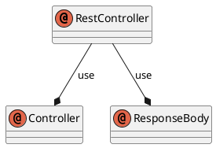

## 开始
在之前运行一个简单入门 `Spring Boot` 程序后, 我们来看看`Spring Boot` 如何快速构建`Restful API`.
熟悉Spring MVC 的可能很熟悉这么几个注解 `@Controller`, `@ResponseBody`, `@RequestMapping`, 由这三个注解我们可以构建起一个`rest`请求.
`@Controller` 用来表示`http`请求对象, `@RequestMapping` 用来配置url映射请求路径,`@ResponseBody` 用来标示返回数据类型, 默认`Json`格式.
`Spring4`之后加入`@RestController`, 组合了 `@Controller` 与 `@ResponseBody` ，如果直接用 `@RestController` 替代 `@Controller` 就不需要再配置 `@ResponseBody`，默认返回`json`格式。

我们来看下`@ResponseBody` 的结构

```java
@Controller
@ResponseBody
public @interface RestController {

    /**
     * The value may indicate a suggestion for a logical component name,
     * to be turned into a Spring bean in case of an autodetected component.
     * @return the suggested component name, if any (or empty String otherwise)
     * @since 4.0.1
     */
    String value() default "";

}
```


## RESTful API 设计
常见 `HTTP` 方法有`GET` `POST` `DELETE` `PUT`, 详细介绍可以参考[HTTP协议](../../)
|请求类型|URL|说明|
|-|-|-|
|GET|/users|查询全部用户信息|
|POST|/users|新建用户信息|
|PUT|/users/id|更新用户信息|
|DELETE|/users/id|删除用户信息|

## RESTful API 实现

### `User`实体定义

```Java
public class User {

    private Long id;
    private String name;
    private Integer age;

    // 省略setter和getter  
}
```

### `User` 操作接口

```Java
@RestController
@RequestMapping(value="/users")     // 通过这里配置使下面的映射都在/users下
public class UserController {

    // 创建线程安全的Map
    static Map<Long, User> users = Collections.synchronizedMap(new HashMap<Long, User>());

    @RequestMapping(value="/", method=RequestMethod.GET)
    public List<User> getUserList() {
        // 处理"/users/"的GET请求，用来获取用户列表
        // 还可以通过@RequestParam从页面中传递参数来进行查询条件或者翻页信息的传递
        List<User> r = new ArrayList<User>(users.values());
        return r;
    }

    @RequestMapping(value="/", method=RequestMethod.POST)
    public String postUser(@ModelAttribute User user) {
        // 处理"/users/"的POST请求，用来创建User
        // 除了@ModelAttribute绑定参数之外，还可以通过@RequestParam从页面中传递参数
        users.put(user.getId(), user);
        return "success";
    }

    @RequestMapping(value="/{id}", method=RequestMethod.GET)
    public User getUser(@PathVariable Long id) {
        // 处理"/users/{id}"的GET请求，用来获取url中id值的User信息
        // url中的id可通过@PathVariable绑定到函数的参数中
        return users.get(id);
    }

    @RequestMapping(value="/{id}", method=RequestMethod.PUT)
    public String putUser(@PathVariable Long id, @ModelAttribute User user) {
        // 处理"/users/{id}"的PUT请求，用来更新User信息
        User u = users.get(id);
        u.setName(user.getName());
        u.setAge(user.getAge());
        users.put(id, u);
        return "success";
    }

    @RequestMapping(value="/{id}", method=RequestMethod.DELETE)
    public String deleteUser(@PathVariable Long id) {
        // 处理"/users/{id}"的DELETE请求，用来删除User
        users.remove(id);
        return "success";
    }

}
```
### 测试

下面针对该`Controller`编写测试用例验证正确性，具体如下。当然也可以通过浏览器插件等进行请求提交验证。

```Java
@RunWith(SpringJUnit4ClassRunner.class)
@SpringApplicationConfiguration(classes = MockServletContext.class)
@WebAppConfiguration
public class ApplicationTests {

    private MockMvc mvc;

    @Before
    public void setUp() throws Exception {
        mvc = MockMvcBuilders.standaloneSetup(new UserController()).build();
    }

    @Test
    public void testUserController() throws Exception {
        // 测试UserController
        RequestBuilder request = null;

        // 1、get查一下user列表，应该为空
        request = get("/users/");
        mvc.perform(request)
                .andExpect(status().isOk())
                .andExpect(content().string(equalTo("[]")));

        // 2、post提交一个user
        request = post("/users/")
                .param("id", "1")
                .param("name", "测试大师")
                .param("age", "20");
        mvc.perform(request)
                .andExpect(content().string(equalTo("success")));

        // 3、get获取user列表，应该有刚才插入的数据
        request = get("/users/");
        mvc.perform(request)
                .andExpect(status().isOk())
                .andExpect(content().string(equalTo("[{\"id\":1,\"name\":\"测试大师\",\"age\":20}]")));

        // 4、put修改id为1的user
        request = put("/users/1")
                .param("name", "测试终极大师")
                .param("age", "30");
        mvc.perform(request)
                .andExpect(content().string(equalTo("success")));

        // 5、get一个id为1的user
        request = get("/users/1");
        mvc.perform(request)
                .andExpect(content().string(equalTo("{\"id\":1,\"name\":\"测试终极大师\",\"age\":30}")));

        // 6、del删除id为1的user
        request = delete("/users/1");
        mvc.perform(request)
                .andExpect(content().string(equalTo("success")));

        // 7、get查一下user列表，应该为空
        request = get("/users/");
        mvc.perform(request)
                .andExpect(status().isOk())
                .andExpect(content().string(equalTo("[]")));·
    }
}
```
## 结尾
至此，我们通过引入`web模块`（0⃣️ 配置），就可以实现`Spring MVC`的功能，以非常简洁的代码完成了对U`ser`对象的`RESTful API`的创建以及单元测试的编写。
其中同时介绍了`Spring MVC`中最为常用的几个核心注解：
`@Controller`,`@RestController`,`RequestMapping`
以及一些参数绑定的注解：
`@PathVariable`,`@ModelAttribute`,`@RequestParam`等。
