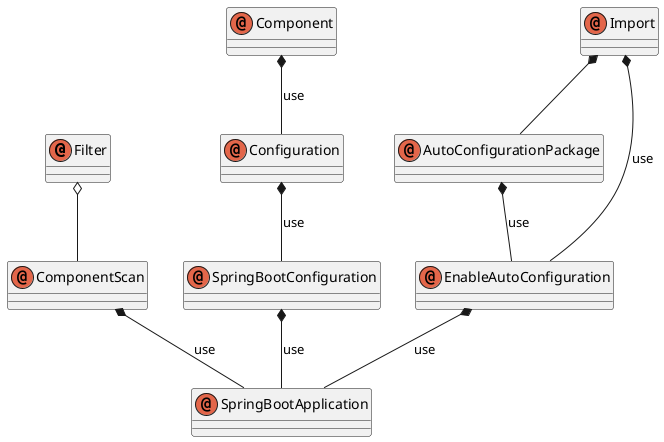

## Spring Boot 基础配置
### 启动开始及配置

Srping Boot 是以被`@SpringBootApplication`标记的类下`main`方法启动的, 该注解是个组合注解,
如下图




可以看出该注解包含了 `@EnableAutoConfiguration` `@SpringBootConfiguration` `@ComponentScan` 这三个注解,
而`@SpringBootConfiguration` 则包含了`@Configuration`.
`@EnableAutoConfiguration` 会根据类路径中的`jar`包依赖为当前项目自动配置.这是`spring boot` 自动化配置的关键.

### 关闭某些配置
从SpringBootApplication 这个注解上我们可以看出来, 要想不启用某些配置,只需要 使用其中的 `exclude`.

```java
SpringBootApplication(exclude = {SecurityAutoConfiguration.class})
```

## Spring Boot配置文件
Spring Boot 支持 `*.properties` , `*.yaml`格式配置, 建议使用`*.yaml`

### 常规属性配置
使用Spring Boot的时候，通过以下方式直接定义：

```yaml
com:
    erasme:
        project: spring boot
        title: 教程
```

在工程里我们就可以`@Value("${属性名}")`使用注解来加载对应的配置属性

```java
@Component
public class TestProperties {
    @Value("${com.erasme.project}")
    private String name;
    @Value("${com.erasme.title}")
    private String title;
    ...
}
```

### 参数引用其他参数
在`application.yaml` 中的各个参数之间也可以直接引用来使用, 如

```yaml
com.erasme.project: Spring Boot
com.erasme.title: 教程
com.erasme.project.long: ${com.didispace.blog.name} - ${com.didispace.blog.title}
```
`com.erasme.project.long` 参数引用了上文中定义的`com.erasme.project`和`com.erasme.title`属性，最后该属性的值就是`_Spring Boot 教程_`。

### 类型安全的配置
使用@Value去注入有时候会显得十分的麻烦,尤其在属性多的情况下.
`Spring Boot` 为此提供了基于类型安全的配置,通过 `@ConfigurationProperties` 将`properties`属性与一个`bean`的属性相关联, 从而实现类型安全的配置.

```yaml
com:
    eraseme:
        person:
            name: erasme
            age: 18
        car:
            band: benz

```

```Java
@Component
@ConfigurationProperties(prifix = "com.erasme.person")
class Person {
    private String name;
    private Integer age;
     ...
}

@Component
@ConfigurationProperties(prifix = "com.erasme.car")
class Person {
    private String band;
     ...
}

```

### 使用随机数
有的时候我们在启动初始化的时候,需要希望它不是一个固定的值,比如密钥、服务端口等。
`Spring Boot`的属性配置文件中可以通过`${random}`来产生`int`值、`long`值或者`string`字符串，来支持属性的随机值。
例如 : `jenkins` 在第一次启动的时候密钥为随机字符串

```yaml
com:
    erasme:
        # 随机字符串
        value: ${random.value}
        # 随机int
        number: ${random.int}
        # 随机long
        bignumber: ${random.long}
        # 10以内的随机数
        test1: ${random.int(10)}
        # 10-20的随机数
        test2: ${random.int[10,20]}
```

### 通过命令行设置属性值
 相信使用过一段时间`Spring Boot`的用户，一定知道这条命令：`java -jar xxx.jar --server.port=9999`，
通过使用`–server.port`属性来设置`xxx.jar`应用的端口为`9999`。

在命令行运行时，连续的两个减号`--`就是对`application.yaml`中的属性值进行赋值的标识。
所以，`java -jar xxx.jar --server.port=9999`命令，相当于我们在`application.yaml`中添加属性`server: port: 9999`，

虽然使用命令行可以改变参数, 但是也会对程序起到干扰,因此`Spring Boot` 也提供了屏蔽命令航参数的配置

```java
SpringApplication.setAddCommandLineProperties(false)。
```

### 多环境配置
通常在开发`Spring Boot`应用时，会有多个不同的环境，比如：开发,测试,预发,生产等。
而这每个环境的配置都是不一样的,如果平凡的变更配置,十分的麻烦。

在现在流行的开发环境下, 多环境的开发通常都是使用多份配置,在打包的时候区分。
Spring Boot 也是如此.
但是,在Spring Boot中多环境配置文件名需要满足`application-{profile}.yaml`的格式，其中`{profile}`对应你的环境标识，比如：

>application-dev.yaml //开发环境
>application-test.yam //测试环境
>application-prod.yaml //生产环境

当然, 要使用哪一个配置,仍然需要告诉Spring Boot. 在application.yaml文件中通过spring: profiles: active属性来设置，其值对应{profile}值。

如：`spring: profiles: active: test`就会加载`application-test.yaml`配置文件内容

下面，以不同环境配置不同的服务端口为例，进行样例实验。

针对各环境新建不同的配置文件 application-dev.yaml、application-test.yaml、application-prod.yaml

在这三个文件均都设置不同的server: port属性，如：dev环境设置为1111，test环境设置为2222，prod环境设置为3333

application.yaml中设置spring: profiles: active: dev，就是说默认以dev环境设置

测试不同配置的加载

执行`java -jar xxx.jar`，可以观察到服务端口被设置为1111，也就是默认的开发环境 __dev__
执行`java -jar xxx.jar --spring.profiles.active=test`，可以观察到服务端口被设置为`2222`，也就是测试环境的配置 __test__
执行`java -jar xxx.jar --spring.profiles.active=prod`，可以观察到服务端口被设置为`3333`，也就是生产环境的配置 __prod__

按照上面的实验，可以如下总结多环境的配置思路：

1. `application.yaml`中配置通用内容，并设置`spring: profiles: active: dev`，以开发环境为默认配置
2. `application-{profile}.yaml`中配置各个环境不同的内容
3. 使用`命令行方式`去激活不同环境的配置

## 使用xml配置
虽然`Spring Boot`提倡使用`Java config` 或者`注解`完成配置, 但是我们仍然可以使用`xml`来配置.
只需要使用 `@ImportResource`
```Java
@ImportResource({"classpath:security-context.xml"})
```

## Spring Boot 是如何运行的
### 如何展示我们启用的配置
前面我们使用的自动配置和自定义配置, 我们知道Spring在4.X中提供了基于条件的配置, Spring Boot也提供了该功能.
Spring Boot的自动配置在`spring-boot-autoconfigure-xxx.jar`下, 提供了非常多的配置

可以通过三种方式查看项目中启用与未启用的配置
1. 运行时`java -jar -xx.jar --debug`
2. `application.yaml` 中配置 `debug: true`
3. IDE中启动项参数,IDEA 中如下, 其他IDE自行摸索


```

  .   ____          _            __ _ _
 /\\ / ___'_ __ _ _(_)_ __  __ _ \ \ \ \
( ( )\___ | '_ | '_| | '_ \/ _` | \ \ \ \
 \\/  ___)| |_)| | | | | || (_| |  ) ) ) )
  '  |____| .__|_| |_|_| |_\__, | / / / /
 =========|_|==============|___/=/_/_/_/
 :: Spring Boot ::        (v1.5.9.RELEASE)

2017-01-14 18:06:03.302  INFO 48806 --- [           main] com.erasme.demo.DemoApplication          : Starting DemoApplication on ErasmeMacBook-Pro.local with PID 48806 (/Users/Erasme/docs/sourceTree/erasme-demo/target/classes started by Erasme in /Users/Erasme/docs/sourceTree/erasme-demo)
2017-01-14 18:06:03.303  INFO 48806 --- [           main] com.erasme.demo.DemoApplication          : No active profile set, falling back to default profiles: default
2017-01-14 18:06:03.303 DEBUG 48806 --- [           main] o.s.boot.SpringApplication               : Loading source class com.erasme.demo.DemoApplication
2017-01-14 18:06:03.384 DEBUG 48806 --- [           main] o.s.b.c.c.ConfigFileApplicationListener  : Skipped (empty) config file 'file:/Users/Erasme/docs/sourceTree/erasme-demo/target/classes/application.properties' (classpath:/application.properties)
2017-01-14 18:06:03.384 DEBUG 48806 --- [           main] o.s.b.c.c.ConfigFileApplicationListener  : Skipped (empty) config file 'file:/Users/Erasme/docs/sourceTree/erasme-demo/target/classes/application.properties' (classpath:/application.properties) for profile default
2017-01-14 18:06:03.390  INFO 48806 --- [           main] ationConfigEmbeddedWebApplicationContext : Refreshing org.springframework.boot.context.embedded.AnnotationConfigEmbeddedWebApplicationContext@3ad83a66: startup date [Sun Jan 14 18:06:03 CST 2018]; root of context hierarchy
2017-01-14 18:06:03.393 DEBUG 48806 --- [           main] ationConfigEmbeddedWebApplicationContext : Bean factory for org.springframework.boot.context.embedded.AnnotationConfigEmbeddedWebApplicationContext@3ad83a66: org.springframework.beans.factory.support.DefaultListableBeanFactory@125290e5: defining beans [org.springframework.context.annotation.internalConfigurationAnnotationProcessor,org.springframework.context.annotation.internalAutowiredAnnotationProcessor,org.springframework.context.annotation.internalRequiredAnnotationProcessor,org.springframework.context.annotation.internalCommonAnnotationProcessor,org.springframework.context.event.internalEventListenerProcessor,org.springframework.context.event.internalEventListenerFactory,demoApplication]; root of factory hierarchy
2017-01-14 18:06:04.116 DEBUG 48806 --- [           main] ationConfigEmbeddedWebApplicationContext : Unable to locate MessageSource with name 'messageSource': using default [org.springframework.context.support.DelegatingMessageSource@27f9e982]
2017-01-14 18:06:04.117 DEBUG 48806 --- [           main] ationConfigEmbeddedWebApplicationContext : Unable to locate ApplicationEventMulticaster with name 'applicationEventMulticaster': using default [org.springframework.context.event.SimpleApplicationEventMulticaster@4593ff34]
2017-01-14 18:06:04.552 DEBUG 48806 --- [           main] .t.TomcatEmbeddedServletContainerFactory : Code archive: /Users/Erasme/.m2/repository/org/springframework/boot/spring-boot/1.5.9.RELEASE/spring-boot-1.5.9.RELEASE.jar
2017-01-14 18:06:04.552 DEBUG 48806 --- [           main] .t.TomcatEmbeddedServletContainerFactory : Code archive: /Users/Erasme/.m2/repository/org/springframework/boot/spring-boot/1.5.9.RELEASE/spring-boot-1.5.9.RELEASE.jar
2017-01-14 18:06:04.552 DEBUG 48806 --- [           main] .t.TomcatEmbeddedServletContainerFactory : None of the document roots [src/main/webapp, public, static] point to a directory and will be ignored.
2017-01-14 18:06:04.593  INFO 48806 --- [           main] s.b.c.e.t.TomcatEmbeddedServletContainer : Tomcat initialized with port(s): 8080 (http)
2017-01-14 18:06:04.605  INFO 48806 --- [           main] o.apache.catalina.core.StandardService   : Starting service [Tomcat]
2017-01-14 18:06:04.606  INFO 48806 --- [           main] org.apache.catalina.core.StandardEngine  : Starting Servlet Engine: Apache Tomcat/8.5.23
2017-01-14 18:06:04.688  INFO 48806 --- [ost-startStop-1] o.a.c.c.C.[Tomcat].[localhost].[/]       : Initializing Spring embedded WebApplicationContext
2017-01-14 18:06:04.688  INFO 48806 --- [ost-startStop-1] o.s.web.context.ContextLoader            : Root WebApplicationContext: initialization completed in 1302 ms
2017-01-14 18:06:04.747 DEBUG 48806 --- [ost-startStop-1] o.s.b.w.s.ServletContextInitializerBeans : Added existing Servlet initializer bean 'dispatcherServletRegistration'; order=2147483647, resource=class path resource [org/springframework/boot/autoconfigure/web/DispatcherServletAutoConfiguration$DispatcherServletRegistrationConfiguration.class]
2017-01-14 18:06:04.793 DEBUG 48806 --- [ost-startStop-1] o.s.b.w.s.ServletContextInitializerBeans : Created Filter initializer for bean 'characterEncodingFilter'; order=-2147483648, resource=class path resource [org/springframework/boot/autoconfigure/web/HttpEncodingAutoConfiguration.class]
2017-01-14 18:06:04.793 DEBUG 48806 --- [ost-startStop-1] o.s.b.w.s.ServletContextInitializerBeans : Created Filter initializer for bean 'hiddenHttpMethodFilter'; order=-10000, resource=class path resource [org/springframework/boot/autoconfigure/web/WebMvcAutoConfiguration.class]
2017-01-14 18:06:04.793 DEBUG 48806 --- [ost-startStop-1] o.s.b.w.s.ServletContextInitializerBeans : Created Filter initializer for bean 'httpPutFormContentFilter'; order=-9900, resource=class path resource [org/springframework/boot/autoconfigure/web/WebMvcAutoConfiguration.class]
2017-01-14 18:06:04.793 DEBUG 48806 --- [ost-startStop-1] o.s.b.w.s.ServletContextInitializerBeans : Created Filter initializer for bean 'requestContextFilter'; order=-105, resource=class path resource [org/springframework/boot/autoconfigure/web/WebMvcAutoConfiguration$WebMvcAutoConfigurationAdapter.class]
2017-01-14 18:06:04.808  INFO 48806 --- [ost-startStop-1] o.s.b.w.servlet.ServletRegistrationBean  : Mapping servlet: 'dispatcherServlet' to [/]
2017-01-14 18:06:04.814  INFO 48806 --- [ost-startStop-1] o.s.b.w.servlet.FilterRegistrationBean   : Mapping filter: 'characterEncodingFilter' to: [/*]
2017-01-14 18:06:04.814  INFO 48806 --- [ost-startStop-1] o.s.b.w.servlet.FilterRegistrationBean   : Mapping filter: 'hiddenHttpMethodFilter' to: [/*]
2017-01-14 18:06:04.815  INFO 48806 --- [ost-startStop-1] o.s.b.w.servlet.FilterRegistrationBean   : Mapping filter: 'httpPutFormContentFilter' to: [/*]
2017-01-14 18:06:04.815  INFO 48806 --- [ost-startStop-1] o.s.b.w.servlet.FilterRegistrationBean   : Mapping filter: 'requestContextFilter' to: [/*]
2017-01-14 18:06:04.837 DEBUG 48806 --- [ost-startStop-1] o.s.b.w.f.OrderedRequestContextFilter    : Initializing filter 'requestContextFilter'
2017-01-14 18:06:04.838 DEBUG 48806 --- [ost-startStop-1] o.s.b.w.f.OrderedRequestContextFilter    : Filter 'requestContextFilter' configured successfully
2017-01-14 18:06:04.839 DEBUG 48806 --- [ost-startStop-1] .s.b.w.f.OrderedHttpPutFormContentFilter : Initializing filter 'httpPutFormContentFilter'
2017-01-14 18:06:04.839 DEBUG 48806 --- [ost-startStop-1] .s.b.w.f.OrderedHttpPutFormContentFilter : Filter 'httpPutFormContentFilter' configured successfully
2017-01-14 18:06:04.840 DEBUG 48806 --- [ost-startStop-1] o.s.b.w.f.OrderedHiddenHttpMethodFilter  : Initializing filter 'hiddenHttpMethodFilter'
2017-01-14 18:06:04.840 DEBUG 48806 --- [ost-startStop-1] o.s.b.w.f.OrderedHiddenHttpMethodFilter  : Filter 'hiddenHttpMethodFilter' configured successfully
2017-01-14 18:06:04.840 DEBUG 48806 --- [ost-startStop-1] o.s.b.w.f.OrderedCharacterEncodingFilter : Initializing filter 'characterEncodingFilter'
2017-01-14 18:06:04.840 DEBUG 48806 --- [ost-startStop-1] o.s.b.w.f.OrderedCharacterEncodingFilter : Filter 'characterEncodingFilter' configured successfully
2017-01-14 18:06:05.101  INFO 48806 --- [           main] s.w.s.m.m.a.RequestMappingHandlerAdapter : Looking for @ControllerAdvice: org.springframework.boot.context.embedded.AnnotationConfigEmbeddedWebApplicationContext@3ad83a66: startup date [Sun Jan 14 18:06:03 CST 2018]; root of context hierarchy
2017-01-14 18:06:05.167  INFO 48806 --- [           main] s.w.s.m.m.a.RequestMappingHandlerMapping : Mapped "{[/hello]}" onto public java.lang.String com.erasme.demo.web.HelloController.index()
2017-01-14 18:06:05.173  INFO 48806 --- [           main] s.w.s.m.m.a.RequestMappingHandlerMapping : Mapped "{[/error]}" onto public org.springframework.http.ResponseEntity<java.util.Map<java.lang.String, java.lang.Object>> org.springframework.boot.autoconfigure.web.BasicErrorController.error(javax.servlet.http.HttpServletRequest)
2017-01-14 18:06:05.173  INFO 48806 --- [           main] s.w.s.m.m.a.RequestMappingHandlerMapping : Mapped "{[/error],produces=[text/html]}" onto public org.springframework.web.servlet.ModelAndView org.springframework.boot.autoconfigure.web.BasicErrorController.errorHtml(javax.servlet.http.HttpServletRequest,javax.servlet.http.HttpServletResponse)
2017-01-14 18:06:05.203  INFO 48806 --- [           main] o.s.w.s.handler.SimpleUrlHandlerMapping  : Mapped URL path [/webjars/**] onto handler of type [class org.springframework.web.servlet.resource.ResourceHttpRequestHandler]
2017-01-14 18:06:05.203  INFO 48806 --- [           main] o.s.w.s.handler.SimpleUrlHandlerMapping  : Mapped URL path [/**] onto handler of type [class org.springframework.web.servlet.resource.ResourceHttpRequestHandler]
2017-01-14 18:06:05.234  INFO 48806 --- [           main] o.s.w.s.handler.SimpleUrlHandlerMapping  : Mapped URL path [/**/favicon.ico] onto handler of type [class org.springframework.web.servlet.resource.ResourceHttpRequestHandler]
2017-01-14 18:06:05.295 DEBUG 48806 --- [           main] inMXBeanRegistrar$SpringApplicationAdmin : Application Admin MBean registered with name 'org.springframework.boot:type=Admin,name=SpringApplication'
2017-01-14 18:06:05.420  INFO 48806 --- [           main] o.s.j.e.a.AnnotationMBeanExporter        : Registering beans for JMX exposure on startup
2017-01-14 18:06:05.427 DEBUG 48806 --- [           main] ationConfigEmbeddedWebApplicationContext : Unable to locate LifecycleProcessor with name 'lifecycleProcessor': using default [org.springframework.context.support.DefaultLifecycleProcessor@15d0849]
2017-01-14 18:06:05.445 DEBUG 48806 --- [           main] utoConfigurationReportLoggingInitializer :


=========================
AUTO-CONFIGURATION REPORT
=========================


Positive matches:
-----------------

   DispatcherServletAutoConfiguration matched:
      - @ConditionalOnClass found required class 'org.springframework.web.servlet.DispatcherServlet'; @ConditionalOnMissingClass did not find unwanted class (OnClassCondition)
      - @ConditionalOnWebApplication (required) found StandardServletEnvironment (OnWebApplicationCondition)

   DispatcherServletAutoConfiguration.DispatcherServletConfiguration matched:
      - @ConditionalOnClass found required class 'javax.servlet.ServletRegistration'; @ConditionalOnMissingClass did not find unwanted class (OnClassCondition)
      - Default DispatcherServlet did not find dispatcher servlet beans (DispatcherServletAutoConfiguration.DefaultDispatcherServletCondition)

   DispatcherServletAutoConfiguration.DispatcherServletRegistrationConfiguration matched:
      - @ConditionalOnClass found required class 'javax.servlet.ServletRegistration'; @ConditionalOnMissingClass did not find unwanted class (OnClassCondition)
      - DispatcherServlet Registration did not find servlet registration bean (DispatcherServletAutoConfiguration.DispatcherServletRegistrationCondition)

   DispatcherServletAutoConfiguration.DispatcherServletRegistrationConfiguration#dispatcherServletRegistration matched:
      - @ConditionalOnBean (names: dispatcherServlet; types: org.springframework.web.servlet.DispatcherServlet; SearchStrategy: all) found beans 'dispatcherServlet', 'dispatcherServlet' (OnBeanCondition)

   EmbeddedServletContainerAutoConfiguration matched:
      - @ConditionalOnWebApplication (required) found StandardServletEnvironment (OnWebApplicationCondition)

   EmbeddedServletContainerAutoConfiguration.EmbeddedTomcat matched:
      - @ConditionalOnClass found required classes 'javax.servlet.Servlet', 'org.apache.catalina.startup.Tomcat'; @ConditionalOnMissingClass did not find unwanted class (OnClassCondition)
      - @ConditionalOnMissingBean (types: org.springframework.boot.context.embedded.EmbeddedServletContainerFactory; SearchStrategy: current) did not find any beans (OnBeanCondition)

   ErrorMvcAutoConfiguration matched:
      - @ConditionalOnClass found required classes 'javax.servlet.Servlet', 'org.springframework.web.servlet.DispatcherServlet'; @ConditionalOnMissingClass did not find unwanted class (OnClassCondition)
      - @ConditionalOnWebApplication (required) found StandardServletEnvironment (OnWebApplicationCondition)

   ErrorMvcAutoConfiguration#basicErrorController matched:
      - @ConditionalOnMissingBean (types: org.springframework.boot.autoconfigure.web.ErrorController; SearchStrategy: current) did not find any beans (OnBeanCondition)

   ErrorMvcAutoConfiguration#errorAttributes matched:
      - @ConditionalOnMissingBean (types: org.springframework.boot.autoconfigure.web.ErrorAttributes; SearchStrategy: current) did not find any beans (OnBeanCondition)

   ErrorMvcAutoConfiguration.DefaultErrorViewResolverConfiguration#conventionErrorViewResolver matched:
      - @ConditionalOnBean (types: org.springframework.web.servlet.DispatcherServlet; SearchStrategy: all) found bean 'dispatcherServlet'; @ConditionalOnMissingBean (types: org.springframework.boot.autoconfigure.web.DefaultErrorViewResolver; SearchStrategy: all) did not find any beans (OnBeanCondition)

   ErrorMvcAutoConfiguration.WhitelabelErrorViewConfiguration matched:
      - @ConditionalOnProperty (server.error.whitelabel.enabled) matched (OnPropertyCondition)
      - ErrorTemplate Missing did not find error template view (ErrorMvcAutoConfiguration.ErrorTemplateMissingCondition)

   ErrorMvcAutoConfiguration.WhitelabelErrorViewConfiguration#beanNameViewResolver matched:
      - @ConditionalOnMissingBean (types: org.springframework.web.servlet.view.BeanNameViewResolver; SearchStrategy: all) did not find any beans (OnBeanCondition)

   ErrorMvcAutoConfiguration.WhitelabelErrorViewConfiguration#defaultErrorView matched:
      - @ConditionalOnMissingBean (names: error; SearchStrategy: all) did not find any beans (OnBeanCondition)

   GenericCacheConfiguration matched:
      - Cache org.springframework.boot.autoconfigure.cache.GenericCacheConfiguration automatic cache type (CacheCondition)

   HttpEncodingAutoConfiguration matched:
      - @ConditionalOnClass found required class 'org.springframework.web.filter.CharacterEncodingFilter'; @ConditionalOnMissingClass did not find unwanted class (OnClassCondition)
      - @ConditionalOnWebApplication (required) found StandardServletEnvironment (OnWebApplicationCondition)
      - @ConditionalOnProperty (spring.http.encoding.enabled) matched (OnPropertyCondition)

   HttpEncodingAutoConfiguration#characterEncodingFilter matched:
      - @ConditionalOnMissingBean (types: org.springframework.web.filter.CharacterEncodingFilter; SearchStrategy: all) did not find any beans (OnBeanCondition)

   HttpMessageConvertersAutoConfiguration matched:
      - @ConditionalOnClass found required class 'org.springframework.http.converter.HttpMessageConverter'; @ConditionalOnMissingClass did not find unwanted class (OnClassCondition)

   HttpMessageConvertersAutoConfiguration#messageConverters matched:
      - @ConditionalOnMissingBean (types: org.springframework.boot.autoconfigure.web.HttpMessageConverters; SearchStrategy: all) did not find any beans (OnBeanCondition)

   HttpMessageConvertersAutoConfiguration.StringHttpMessageConverterConfiguration matched:
      - @ConditionalOnClass found required class 'org.springframework.http.converter.StringHttpMessageConverter'; @ConditionalOnMissingClass did not find unwanted class (OnClassCondition)

   HttpMessageConvertersAutoConfiguration.StringHttpMessageConverterConfiguration#stringHttpMessageConverter matched:
      - @ConditionalOnMissingBean (types: org.springframework.http.converter.StringHttpMessageConverter; SearchStrategy: all) did not find any beans (OnBeanCondition)

   JacksonAutoConfiguration matched:
      - @ConditionalOnClass found required class 'com.fasterxml.jackson.databind.ObjectMapper'; @ConditionalOnMissingClass did not find unwanted class (OnClassCondition)

   JacksonAutoConfiguration.Jackson2ObjectMapperBuilderCustomizerConfiguration matched:
      - @ConditionalOnClass found required classes 'com.fasterxml.jackson.databind.ObjectMapper', 'org.springframework.http.converter.json.Jackson2ObjectMapperBuilder'; @ConditionalOnMissingClass did not find unwanted class (OnClassCondition)

   JacksonAutoConfiguration.JacksonObjectMapperBuilderConfiguration matched:
      - @ConditionalOnClass found required classes 'com.fasterxml.jackson.databind.ObjectMapper', 'org.springframework.http.converter.json.Jackson2ObjectMapperBuilder'; @ConditionalOnMissingClass did not find unwanted class (OnClassCondition)

   JacksonAutoConfiguration.JacksonObjectMapperBuilderConfiguration#jacksonObjectMapperBuilder matched:
      - @ConditionalOnMissingBean (types: org.springframework.http.converter.json.Jackson2ObjectMapperBuilder; SearchStrategy: all) did not find any beans (OnBeanCondition)

   JacksonAutoConfiguration.JacksonObjectMapperConfiguration matched:
      - @ConditionalOnClass found required classes 'com.fasterxml.jackson.databind.ObjectMapper', 'org.springframework.http.converter.json.Jackson2ObjectMapperBuilder'; @ConditionalOnMissingClass did not find unwanted class (OnClassCondition)

   JacksonAutoConfiguration.JacksonObjectMapperConfiguration#jacksonObjectMapper matched:
      - @ConditionalOnMissingBean (types: com.fasterxml.jackson.databind.ObjectMapper; SearchStrategy: all) did not find any beans (OnBeanCondition)

   JacksonHttpMessageConvertersConfiguration.MappingJackson2HttpMessageConverterConfiguration matched:
      - @ConditionalOnClass found required class 'com.fasterxml.jackson.databind.ObjectMapper'; @ConditionalOnMissingClass did not find unwanted class (OnClassCondition)
      - @ConditionalOnProperty (spring.http.converters.preferred-json-mapper=jackson) matched (OnPropertyCondition)
      - @ConditionalOnBean (types: com.fasterxml.jackson.databind.ObjectMapper; SearchStrategy: all) found bean 'jacksonObjectMapper' (OnBeanCondition)

   JacksonHttpMessageConvertersConfiguration.MappingJackson2HttpMessageConverterConfiguration#mappingJackson2HttpMessageConverter matched:
      - @ConditionalOnMissingBean (types: org.springframework.http.converter.json.MappingJackson2HttpMessageConverter; SearchStrategy: all) did not find any beans (OnBeanCondition)

   JmxAutoConfiguration matched:
      - @ConditionalOnClass found required class 'org.springframework.jmx.export.MBeanExporter'; @ConditionalOnMissingClass did not find unwanted class (OnClassCondition)
      - @ConditionalOnProperty (spring.jmx.enabled=true) matched (OnPropertyCondition)

   JmxAutoConfiguration#mbeanExporter matched:
      - @ConditionalOnMissingBean (types: org.springframework.jmx.export.MBeanExporter; SearchStrategy: current) did not find any beans (OnBeanCondition)

   JmxAutoConfiguration#mbeanServer matched:
      - @ConditionalOnMissingBean (types: javax.management.MBeanServer; SearchStrategy: all) did not find any beans (OnBeanCondition)

   JmxAutoConfiguration#objectNamingStrategy matched:
      - @ConditionalOnMissingBean (types: org.springframework.jmx.export.naming.ObjectNamingStrategy; SearchStrategy: current) did not find any beans (OnBeanCondition)

   MultipartAutoConfiguration matched:
      - @ConditionalOnClass found required classes 'javax.servlet.Servlet', 'org.springframework.web.multipart.support.StandardServletMultipartResolver', 'javax.servlet.MultipartConfigElement'; @ConditionalOnMissingClass did not find unwanted class (OnClassCondition)
      - @ConditionalOnProperty (spring.http.multipart.enabled) matched (OnPropertyCondition)

   MultipartAutoConfiguration#multipartConfigElement matched:
      - @ConditionalOnMissingBean (types: javax.servlet.MultipartConfigElement; SearchStrategy: all) did not find any beans (OnBeanCondition)

   MultipartAutoConfiguration#multipartResolver matched:
      - @ConditionalOnMissingBean (types: org.springframework.web.multipart.MultipartResolver; SearchStrategy: all) did not find any beans (OnBeanCondition)

   NoOpCacheConfiguration matched:
      - Cache org.springframework.boot.autoconfigure.cache.NoOpCacheConfiguration automatic cache type (CacheCondition)

   PropertyPlaceholderAutoConfiguration#propertySourcesPlaceholderConfigurer matched:
      - @ConditionalOnMissingBean (types: org.springframework.context.support.PropertySourcesPlaceholderConfigurer; SearchStrategy: current) did not find any beans (OnBeanCondition)

   RedisCacheConfiguration matched:
      - Cache org.springframework.boot.autoconfigure.cache.RedisCacheConfiguration automatic cache type (CacheCondition)

   ServerPropertiesAutoConfiguration matched:
      - @ConditionalOnWebApplication (required) found StandardServletEnvironment (OnWebApplicationCondition)

   ServerPropertiesAutoConfiguration#serverProperties matched:
      - @ConditionalOnMissingBean (types: org.springframework.boot.autoconfigure.web.ServerProperties; SearchStrategy: current) did not find any beans (OnBeanCondition)

   SimpleCacheConfiguration matched:
      - Cache org.springframework.boot.autoconfigure.cache.SimpleCacheConfiguration automatic cache type (CacheCondition)

   SpringApplicationAdminJmxAutoConfiguration matched:
      - @ConditionalOnProperty (spring.application.admin.enabled=true) matched (OnPropertyCondition)

   SpringApplicationAdminJmxAutoConfiguration#springApplicationAdminRegistrar matched:
      - @ConditionalOnMissingBean (types: org.springframework.boot.admin.SpringApplicationAdminMXBeanRegistrar; SearchStrategy: all) did not find any beans (OnBeanCondition)

   ValidationAutoConfiguration matched:
      - @ConditionalOnClass found required class 'javax.validation.executable.ExecutableValidator'; @ConditionalOnMissingClass did not find unwanted class (OnClassCondition)
      - @ConditionalOnResource found location classpath:META-INF/services/javax.validation.spi.ValidationProvider (OnResourceCondition)

   ValidationAutoConfiguration#defaultValidator matched:
      - @ConditionalOnMissingBean (types: javax.validation.Validator; SearchStrategy: all) did not find any beans (OnBeanCondition)

   ValidationAutoConfiguration#methodValidationPostProcessor matched:
      - @ConditionalOnMissingBean (types: org.springframework.validation.beanvalidation.MethodValidationPostProcessor; SearchStrategy: all) did not find any beans (OnBeanCondition)

   WebClientAutoConfiguration.RestTemplateConfiguration matched:
      - @ConditionalOnClass found required class 'org.springframework.web.client.RestTemplate'; @ConditionalOnMissingClass did not find unwanted class (OnClassCondition)

   WebClientAutoConfiguration.RestTemplateConfiguration#restTemplateBuilder matched:
      - @ConditionalOnMissingBean (types: org.springframework.boot.web.client.RestTemplateBuilder; SearchStrategy: all) did not find any beans (OnBeanCondition)

   WebMvcAutoConfiguration matched:
      - @ConditionalOnClass found required classes 'javax.servlet.Servlet', 'org.springframework.web.servlet.DispatcherServlet', 'org.springframework.web.servlet.config.annotation.WebMvcConfigurerAdapter'; @ConditionalOnMissingClass did not find unwanted class (OnClassCondition)
      - @ConditionalOnWebApplication (required) found StandardServletEnvironment (OnWebApplicationCondition)
      - @ConditionalOnMissingBean (types: org.springframework.web.servlet.config.annotation.WebMvcConfigurationSupport; SearchStrategy: all) did not find any beans (OnBeanCondition)

   WebMvcAutoConfiguration#hiddenHttpMethodFilter matched:
      - @ConditionalOnMissingBean (types: org.springframework.web.filter.HiddenHttpMethodFilter; SearchStrategy: all) did not find any beans (OnBeanCondition)

   WebMvcAutoConfiguration#httpPutFormContentFilter matched:
      - @ConditionalOnProperty (spring.mvc.formcontent.putfilter.enabled) matched (OnPropertyCondition)
      - @ConditionalOnMissingBean (types: org.springframework.web.filter.HttpPutFormContentFilter; SearchStrategy: all) did not find any beans (OnBeanCondition)

   WebMvcAutoConfiguration.WebMvcAutoConfigurationAdapter#defaultViewResolver matched:
      - @ConditionalOnMissingBean (types: org.springframework.web.servlet.view.InternalResourceViewResolver; SearchStrategy: all) did not find any beans (OnBeanCondition)

   WebMvcAutoConfiguration.WebMvcAutoConfigurationAdapter#requestContextFilter matched:
      - @ConditionalOnMissingBean (types: org.springframework.web.context.request.RequestContextListener,org.springframework.web.filter.RequestContextFilter; SearchStrategy: all) did not find any beans (OnBeanCondition)

   WebMvcAutoConfiguration.WebMvcAutoConfigurationAdapter#viewResolver matched:
      - @ConditionalOnBean (types: org.springframework.web.servlet.ViewResolver; SearchStrategy: all) found beans 'defaultViewResolver', 'beanNameViewResolver', 'mvcViewResolver'; @ConditionalOnMissingBean (names: viewResolver; types: org.springframework.web.servlet.view.ContentNegotiatingViewResolver; SearchStrategy: all) did not find any beans (OnBeanCondition)

   WebMvcAutoConfiguration.WebMvcAutoConfigurationAdapter.FaviconConfiguration matched:
      - @ConditionalOnProperty (spring.mvc.favicon.enabled) matched (OnPropertyCondition)

   WebSocketAutoConfiguration matched:
      - @ConditionalOnClass found required classes 'javax.servlet.Servlet', 'javax.websocket.server.ServerContainer'; @ConditionalOnMissingClass did not find unwanted class (OnClassCondition)
      - @ConditionalOnWebApplication (required) found StandardServletEnvironment (OnWebApplicationCondition)

   WebSocketAutoConfiguration.TomcatWebSocketConfiguration matched:
      - @ConditionalOnClass found required classes 'org.apache.catalina.startup.Tomcat', 'org.apache.tomcat.websocket.server.WsSci'; @ConditionalOnMissingClass did not find unwanted class (OnClassCondition)

   WebSocketAutoConfiguration.TomcatWebSocketConfiguration#websocketContainerCustomizer matched:
      - @ConditionalOnJava (1.7 or newer) found 1.8 (OnJavaCondition)
      - @ConditionalOnMissingBean (names: websocketContainerCustomizer; SearchStrategy: all) did not find any beans (OnBeanCondition)


Negative matches:
-----------------

   ActiveMQAutoConfiguration:
      Did not match:
         - @ConditionalOnClass did not find required classes 'javax.jms.ConnectionFactory', 'org.apache.activemq.ActiveMQConnectionFactory' (OnClassCondition)

   AopAutoConfiguration:
      Did not match:
         - @ConditionalOnClass did not find required classes 'org.aspectj.lang.annotation.Aspect', 'org.aspectj.lang.reflect.Advice' (OnClassCondition)

   ArtemisAutoConfiguration:
      Did not match:
         - @ConditionalOnClass did not find required classes 'javax.jms.ConnectionFactory', 'org.apache.activemq.artemis.jms.client.ActiveMQConnectionFactory' (OnClassCondition)

   BatchAutoConfiguration:
      Did not match:
         - @ConditionalOnClass did not find required classes 'org.springframework.batch.core.launch.JobLauncher', 'org.springframework.jdbc.core.JdbcOperations' (OnClassCondition)

   CacheAutoConfiguration:
      Did not match:
         - @ConditionalOnBean (types: org.springframework.cache.interceptor.CacheAspectSupport; SearchStrategy: all) did not find any beans (OnBeanCondition)
      Matched:
         - @ConditionalOnClass found required class 'org.springframework.cache.CacheManager'; @ConditionalOnMissingClass did not find unwanted class (OnClassCondition)

   CacheAutoConfiguration.CacheManagerJpaDependencyConfiguration:
      Did not match:
         - @ConditionalOnClass did not find required class 'org.springframework.orm.jpa.LocalContainerEntityManagerFactoryBean' (OnClassCondition)
         - Ancestor org.springframework.boot.autoconfigure.cache.CacheAutoConfiguration did not match (ConditionEvaluationReport.AncestorsMatchedCondition)

   CaffeineCacheConfiguration:
      Did not match:
         - @ConditionalOnClass did not find required classes 'com.github.benmanes.caffeine.cache.Caffeine', 'org.springframework.cache.caffeine.CaffeineCacheManager' (OnClassCondition)

   CassandraAutoConfiguration:
      Did not match:
         - @ConditionalOnClass did not find required class 'com.datastax.driver.core.Cluster' (OnClassCondition)

   CassandraDataAutoConfiguration:
      Did not match:
         - @ConditionalOnClass did not find required classes 'com.datastax.driver.core.Cluster', 'org.springframework.data.cassandra.core.CassandraAdminOperations' (OnClassCondition)

   CassandraRepositoriesAutoConfiguration:
      Did not match:
         - @ConditionalOnClass did not find required classes 'com.datastax.driver.core.Session', 'org.springframework.data.cassandra.repository.CassandraRepository' (OnClassCondition)

   CloudAutoConfiguration:
      Did not match:
         - @ConditionalOnClass did not find required class 'org.springframework.cloud.config.java.CloudScanConfiguration' (OnClassCondition)

   CouchbaseAutoConfiguration:
      Did not match:
         - @ConditionalOnClass did not find required classes 'com.couchbase.client.java.CouchbaseBucket', 'com.couchbase.client.java.Cluster' (OnClassCondition)

   CouchbaseCacheConfiguration:
      Did not match:
         - @ConditionalOnClass did not find required classes 'com.couchbase.client.java.Bucket', 'com.couchbase.client.spring.cache.CouchbaseCacheManager' (OnClassCondition)

   CouchbaseDataAutoConfiguration:
      Did not match:
         - @ConditionalOnClass did not find required classes 'com.couchbase.client.java.Bucket', 'org.springframework.data.couchbase.repository.CouchbaseRepository' (OnClassCondition)

   CouchbaseRepositoriesAutoConfiguration:
      Did not match:
         - @ConditionalOnClass did not find required classes 'com.couchbase.client.java.Bucket', 'org.springframework.data.couchbase.repository.CouchbaseRepository' (OnClassCondition)

   DataSourceAutoConfiguration:
      Did not match:
         - @ConditionalOnClass did not find required class 'org.springframework.jdbc.datasource.embedded.EmbeddedDatabaseType' (OnClassCondition)

   DataSourceTransactionManagerAutoConfiguration:
      Did not match:
         - @ConditionalOnClass did not find required classes 'org.springframework.jdbc.core.JdbcTemplate', 'org.springframework.transaction.PlatformTransactionManager' (OnClassCondition)

   DeviceDelegatingViewResolverAutoConfiguration:
      Did not match:
         - @ConditionalOnClass did not find required class 'org.springframework.mobile.device.view.LiteDeviceDelegatingViewResolver' (OnClassCondition)

   DeviceResolverAutoConfiguration:
      Did not match:
         - @ConditionalOnClass did not find required classes 'org.springframework.mobile.device.DeviceResolverHandlerInterceptor', 'org.springframework.mobile.device.DeviceHandlerMethodArgumentResolver' (OnClassCondition)

   DispatcherServletAutoConfiguration.DispatcherServletConfiguration#multipartResolver:
      Did not match:
         - @ConditionalOnBean (types: org.springframework.web.multipart.MultipartResolver; SearchStrategy: all) did not find any beans (OnBeanCondition)

   EhCacheCacheConfiguration:
      Did not match:
         - @ConditionalOnClass did not find required classes 'net.sf.ehcache.Cache', 'org.springframework.cache.ehcache.EhCacheCacheManager' (OnClassCondition)

   ElasticsearchAutoConfiguration:
      Did not match:
         - @ConditionalOnClass did not find required classes 'org.elasticsearch.client.Client', 'org.springframework.data.elasticsearch.client.TransportClientFactoryBean', 'org.springframework.data.elasticsearch.client.NodeClientFactoryBean' (OnClassCondition)

   ElasticsearchDataAutoConfiguration:
      Did not match:
         - @ConditionalOnClass did not find required classes 'org.elasticsearch.client.Client', 'org.springframework.data.elasticsearch.core.ElasticsearchTemplate' (OnClassCondition)

   ElasticsearchRepositoriesAutoConfiguration:
      Did not match:
         - @ConditionalOnClass did not find required classes 'org.elasticsearch.client.Client', 'org.springframework.data.elasticsearch.repository.ElasticsearchRepository' (OnClassCondition)

   EmbeddedLdapAutoConfiguration:
      Did not match:
         - @ConditionalOnClass did not find required class 'com.unboundid.ldap.listener.InMemoryDirectoryServer' (OnClassCondition)

   EmbeddedMongoAutoConfiguration:
      Did not match:
         - @ConditionalOnClass did not find required classes 'com.mongodb.Mongo', 'de.flapdoodle.embed.mongo.MongodStarter' (OnClassCondition)

   EmbeddedServletContainerAutoConfiguration.EmbeddedJetty:
      Did not match:
         - @ConditionalOnClass did not find required classes 'org.eclipse.jetty.server.Server', 'org.eclipse.jetty.util.Loader', 'org.eclipse.jetty.webapp.WebAppContext' (OnClassCondition)

   EmbeddedServletContainerAutoConfiguration.EmbeddedUndertow:
      Did not match:
         - @ConditionalOnClass did not find required classes 'io.undertow.Undertow', 'org.xnio.SslClientAuthMode' (OnClassCondition)

   FacebookAutoConfiguration:
      Did not match:
         - @ConditionalOnClass did not find required classes 'org.springframework.social.config.annotation.SocialConfigurerAdapter', 'org.springframework.social.facebook.connect.FacebookConnectionFactory' (OnClassCondition)

   FallbackWebSecurityAutoConfiguration:
      Did not match:
         - @ConditionalOnClass did not find required class 'org.springframework.security.config.annotation.web.configuration.EnableWebSecurity' (OnClassCondition)

   FlywayAutoConfiguration:
      Did not match:
         - @ConditionalOnClass did not find required class 'org.flywaydb.core.Flyway' (OnClassCondition)

   FreeMarkerAutoConfiguration:
      Did not match:
         - @ConditionalOnClass did not find required classes 'freemarker.template.Configuration', 'org.springframework.ui.freemarker.FreeMarkerConfigurationFactory' (OnClassCondition)

   GroovyTemplateAutoConfiguration:
      Did not match:
         - @ConditionalOnClass did not find required class 'groovy.text.markup.MarkupTemplateEngine' (OnClassCondition)

   GsonAutoConfiguration:
      Did not match:
         - @ConditionalOnClass did not find required class 'com.google.gson.Gson' (OnClassCondition)

   GsonHttpMessageConvertersConfiguration:
      Did not match:
         - @ConditionalOnClass did not find required class 'com.google.gson.Gson' (OnClassCondition)

   GuavaCacheConfiguration:
      Did not match:
         - @ConditionalOnClass did not find required classes 'com.google.common.cache.CacheBuilder', 'org.springframework.cache.guava.GuavaCacheManager' (OnClassCondition)

   H2ConsoleAutoConfiguration:
      Did not match:
         - @ConditionalOnClass did not find required class 'org.h2.server.web.WebServlet' (OnClassCondition)

   HazelcastAutoConfiguration:
      Did not match:
         - @ConditionalOnClass did not find required class 'com.hazelcast.core.HazelcastInstance' (OnClassCondition)

   HazelcastCacheConfiguration:
      Did not match:
         - @ConditionalOnClass did not find required classes 'com.hazelcast.core.HazelcastInstance', 'com.hazelcast.spring.cache.HazelcastCacheManager' (OnClassCondition)

   HazelcastJpaDependencyAutoConfiguration:
      Did not match:
         - @ConditionalOnClass did not find required classes 'com.hazelcast.core.HazelcastInstance', 'org.springframework.orm.jpa.LocalContainerEntityManagerFactoryBean' (OnClassCondition)

   HibernateJpaAutoConfiguration:
      Did not match:
         - @ConditionalOnClass did not find required classes 'org.springframework.orm.jpa.LocalContainerEntityManagerFactoryBean', 'javax.persistence.EntityManager' (OnClassCondition)

   HypermediaAutoConfiguration:
      Did not match:
         - @ConditionalOnClass did not find required classes 'org.springframework.hateoas.Resource', 'org.springframework.plugin.core.Plugin' (OnClassCondition)

   InfinispanCacheConfiguration:
      Did not match:
         - @ConditionalOnClass did not find required class 'org.infinispan.spring.provider.SpringEmbeddedCacheManager' (OnClassCondition)

   IntegrationAutoConfiguration:
      Did not match:
         - @ConditionalOnClass did not find required class 'org.springframework.integration.config.EnableIntegration' (OnClassCondition)

   JCacheCacheConfiguration:
      Did not match:
         - @ConditionalOnClass did not find required classes 'javax.cache.Caching', 'org.springframework.cache.jcache.JCacheCacheManager' (OnClassCondition)

   JacksonAutoConfiguration.JodaDateTimeJacksonConfiguration:
      Did not match:
         - @ConditionalOnClass did not find required classes 'org.joda.time.DateTime', 'com.fasterxml.jackson.datatype.joda.ser.DateTimeSerializer', 'com.fasterxml.jackson.datatype.joda.cfg.JacksonJodaDateFormat' (OnClassCondition)

   JacksonAutoConfiguration.ParameterNamesModuleConfiguration:
      Did not match:
         - @ConditionalOnClass did not find required class 'com.fasterxml.jackson.module.paramnames.ParameterNamesModule' (OnClassCondition)

   JacksonHttpMessageConvertersConfiguration.MappingJackson2XmlHttpMessageConverterConfiguration:
      Did not match:
         - @ConditionalOnClass did not find required class 'com.fasterxml.jackson.dataformat.xml.XmlMapper' (OnClassCondition)

   JdbcTemplateAutoConfiguration:
      Did not match:
         - @ConditionalOnClass did not find required class 'org.springframework.jdbc.core.JdbcTemplate' (OnClassCondition)

   JerseyAutoConfiguration:
      Did not match:
         - @ConditionalOnClass did not find required class 'org.glassfish.jersey.server.spring.SpringComponentProvider' (OnClassCondition)

   JestAutoConfiguration:
      Did not match:
         - @ConditionalOnClass did not find required class 'io.searchbox.client.JestClient' (OnClassCondition)

   JmsAutoConfiguration:
      Did not match:
         - @ConditionalOnClass did not find required classes 'javax.jms.Message', 'org.springframework.jms.core.JmsTemplate' (OnClassCondition)

   JndiConnectionFactoryAutoConfiguration:
      Did not match:
         - @ConditionalOnClass did not find required class 'org.springframework.jms.core.JmsTemplate' (OnClassCondition)

   JndiDataSourceAutoConfiguration:
      Did not match:
         - @ConditionalOnClass did not find required class 'org.springframework.jdbc.datasource.embedded.EmbeddedDatabaseType' (OnClassCondition)

   JooqAutoConfiguration:
      Did not match:
         - @ConditionalOnClass did not find required class 'org.jooq.DSLContext' (OnClassCondition)

   JpaRepositoriesAutoConfiguration:
      Did not match:
         - @ConditionalOnClass did not find required class 'org.springframework.data.jpa.repository.JpaRepository' (OnClassCondition)

   JtaAutoConfiguration:
      Did not match:
         - @ConditionalOnClass did not find required class 'javax.transaction.Transaction' (OnClassCondition)

   KafkaAutoConfiguration:
      Did not match:
         - @ConditionalOnClass did not find required class 'org.springframework.kafka.core.KafkaTemplate' (OnClassCondition)

   LdapAutoConfiguration:
      Did not match:
         - @ConditionalOnClass did not find required class 'org.springframework.ldap.core.ContextSource' (OnClassCondition)

   LdapDataAutoConfiguration:
      Did not match:
         - @ConditionalOnClass did not find required class 'org.springframework.data.ldap.repository.LdapRepository' (OnClassCondition)

   LdapRepositoriesAutoConfiguration:
      Did not match:
         - @ConditionalOnClass did not find required class 'org.springframework.data.ldap.repository.LdapRepository' (OnClassCondition)

   LinkedInAutoConfiguration:
      Did not match:
         - @ConditionalOnClass did not find required classes 'org.springframework.social.config.annotation.SocialConfigurerAdapter', 'org.springframework.social.linkedin.connect.LinkedInConnectionFactory' (OnClassCondition)

   LiquibaseAutoConfiguration:
      Did not match:
         - @ConditionalOnClass did not find required class 'liquibase.integration.spring.SpringLiquibase' (OnClassCondition)

   MailSenderAutoConfiguration:
      Did not match:
         - @ConditionalOnClass did not find required class 'javax.mail.internet.MimeMessage' (OnClassCondition)

   MailSenderValidatorAutoConfiguration:
      Did not match:
         - @ConditionalOnProperty (spring.mail.test-connection) did not find property 'test-connection' (OnPropertyCondition)

   MessageSourceAutoConfiguration:
      Did not match:
         - ResourceBundle did not find bundle with basename messages (MessageSourceAutoConfiguration.ResourceBundleCondition)

   MongoAutoConfiguration:
      Did not match:
         - @ConditionalOnClass did not find required class 'com.mongodb.MongoClient' (OnClassCondition)

   MongoDataAutoConfiguration:
      Did not match:
         - @ConditionalOnClass did not find required classes 'com.mongodb.Mongo', 'org.springframework.data.mongodb.core.MongoTemplate' (OnClassCondition)

   MongoRepositoriesAutoConfiguration:
      Did not match:
         - @ConditionalOnClass did not find required classes 'com.mongodb.Mongo', 'org.springframework.data.mongodb.repository.MongoRepository' (OnClassCondition)

   MustacheAutoConfiguration:
      Did not match:
         - @ConditionalOnClass did not find required class 'com.samskivert.mustache.Mustache' (OnClassCondition)

   Neo4jDataAutoConfiguration:
      Did not match:
         - @ConditionalOnClass did not find required classes 'org.neo4j.ogm.session.SessionFactory', 'org.springframework.data.neo4j.transaction.Neo4jTransactionManager', 'org.springframework.transaction.PlatformTransactionManager' (OnClassCondition)

   Neo4jRepositoriesAutoConfiguration:
      Did not match:
         - @ConditionalOnClass did not find required classes 'org.neo4j.ogm.session.Neo4jSession', 'org.springframework.data.neo4j.repository.GraphRepository' (OnClassCondition)

   OAuth2AutoConfiguration:
      Did not match:
         - @ConditionalOnClass did not find required class 'org.springframework.security.oauth2.common.OAuth2AccessToken' (OnClassCondition)

   PersistenceExceptionTranslationAutoConfiguration:
      Did not match:
         - @ConditionalOnClass did not find required class 'org.springframework.dao.annotation.PersistenceExceptionTranslationPostProcessor' (OnClassCondition)

   ProjectInfoAutoConfiguration#buildProperties:
      Did not match:
         - @ConditionalOnResource did not find resource '${spring.info.build.location:classpath:META-INF/build-info.properties}' (OnResourceCondition)

   ProjectInfoAutoConfiguration#gitProperties:
      Did not match:
         - GitResource did not find git info at classpath:git.properties (ProjectInfoAutoConfiguration.GitResourceAvailableCondition)

   RabbitAutoConfiguration:
      Did not match:
         - @ConditionalOnClass did not find required classes 'org.springframework.amqp.rabbit.core.RabbitTemplate', 'com.rabbitmq.client.Channel' (OnClassCondition)

   ReactorAutoConfiguration:
      Did not match:
         - @ConditionalOnClass did not find required classes 'reactor.spring.context.config.EnableReactor', 'reactor.Environment' (OnClassCondition)

   RedisAutoConfiguration:
      Did not match:
         - @ConditionalOnClass did not find required classes 'org.springframework.data.redis.connection.jedis.JedisConnection', 'org.springframework.data.redis.core.RedisOperations', 'redis.clients.jedis.Jedis' (OnClassCondition)

   RedisRepositoriesAutoConfiguration:
      Did not match:
         - @ConditionalOnClass did not find required classes 'redis.clients.jedis.Jedis', 'org.springframework.data.redis.repository.configuration.EnableRedisRepositories' (OnClassCondition)

   RepositoryRestMvcAutoConfiguration:
      Did not match:
         - @ConditionalOnClass did not find required class 'org.springframework.data.rest.webmvc.config.RepositoryRestMvcConfiguration' (OnClassCondition)

   SecurityAutoConfiguration:
      Did not match:
         - @ConditionalOnClass did not find required classes 'org.springframework.security.authentication.AuthenticationManager', 'org.springframework.security.config.annotation.authentication.configurers.GlobalAuthenticationConfigurerAdapter' (OnClassCondition)

   SecurityFilterAutoConfiguration:
      Did not match:
         - @ConditionalOnClass did not find required classes 'org.springframework.security.web.context.AbstractSecurityWebApplicationInitializer', 'org.springframework.security.config.http.SessionCreationPolicy' (OnClassCondition)

   SendGridAutoConfiguration:
      Did not match:
         - @ConditionalOnClass did not find required class 'com.sendgrid.SendGrid' (OnClassCondition)

   SessionAutoConfiguration:
      Did not match:
         - @ConditionalOnClass did not find required class 'org.springframework.session.Session' (OnClassCondition)

   SitePreferenceAutoConfiguration:
      Did not match:
         - @ConditionalOnClass did not find required classes 'org.springframework.mobile.device.site.SitePreferenceHandlerInterceptor', 'org.springframework.mobile.device.site.SitePreferenceHandlerMethodArgumentResolver' (OnClassCondition)

   SocialWebAutoConfiguration:
      Did not match:
         - @ConditionalOnClass did not find required classes 'org.springframework.social.connect.web.ConnectController', 'org.springframework.social.config.annotation.SocialConfigurerAdapter' (OnClassCondition)

   SolrAutoConfiguration:
      Did not match:
         - @ConditionalOnClass did not find required classes 'org.apache.solr.client.solrj.impl.HttpSolrClient', 'org.apache.solr.client.solrj.impl.CloudSolrClient' (OnClassCondition)

   SolrRepositoriesAutoConfiguration:
      Did not match:
         - @ConditionalOnClass did not find required classes 'org.apache.solr.client.solrj.SolrClient', 'org.springframework.data.solr.repository.SolrRepository' (OnClassCondition)

   SpringDataWebAutoConfiguration:
      Did not match:
         - @ConditionalOnClass did not find required class 'org.springframework.data.web.PageableHandlerMethodArgumentResolver' (OnClassCondition)

   ThymeleafAutoConfiguration:
      Did not match:
         - @ConditionalOnClass did not find required class 'org.thymeleaf.spring4.SpringTemplateEngine' (OnClassCondition)

   TransactionAutoConfiguration:
      Did not match:
         - @ConditionalOnClass did not find required class 'org.springframework.transaction.PlatformTransactionManager' (OnClassCondition)

   TwitterAutoConfiguration:
      Did not match:
         - @ConditionalOnClass did not find required classes 'org.springframework.social.config.annotation.SocialConfigurerAdapter', 'org.springframework.social.twitter.connect.TwitterConnectionFactory' (OnClassCondition)

   WebMvcAutoConfiguration.ResourceChainCustomizerConfiguration:
      Did not match:
         - @ConditionalOnEnabledResourceChain did not find class org.webjars.WebJarAssetLocator (OnEnabledResourceChainCondition)

   WebMvcAutoConfiguration.WebMvcAutoConfigurationAdapter#beanNameViewResolver:
      Did not match:
         - @ConditionalOnMissingBean (types: org.springframework.web.servlet.view.BeanNameViewResolver; SearchStrategy: all) found bean 'beanNameViewResolver' (OnBeanCondition)

   WebMvcAutoConfiguration.WebMvcAutoConfigurationAdapter#dateFormatter:
      Did not match:
         - @ConditionalOnProperty (spring.mvc.date-format) did not find property 'date-format' (OnPropertyCondition)

   WebMvcAutoConfiguration.WebMvcAutoConfigurationAdapter#localeResolver:
      Did not match:
         - @ConditionalOnProperty (spring.mvc.locale) did not find property 'locale' (OnPropertyCondition)

   WebServicesAutoConfiguration:
      Did not match:
         - @ConditionalOnClass did not find required class 'org.springframework.ws.transport.http.MessageDispatcherServlet' (OnClassCondition)

   WebSocketAutoConfiguration.JettyWebSocketConfiguration:
      Did not match:
         - @ConditionalOnClass did not find required class 'org.eclipse.jetty.websocket.jsr356.server.deploy.WebSocketServerContainerInitializer' (OnClassCondition)

   WebSocketAutoConfiguration.UndertowWebSocketConfiguration:
      Did not match:
         - @ConditionalOnClass did not find required class 'io.undertow.websockets.jsr.Bootstrap' (OnClassCondition)

   WebSocketMessagingAutoConfiguration:
      Did not match:
         - @ConditionalOnClass did not find required class 'org.springframework.web.socket.config.annotation.WebSocketMessageBrokerConfigurer' (OnClassCondition)

   XADataSourceAutoConfiguration:
      Did not match:
         - @ConditionalOnClass did not find required classes 'javax.transaction.TransactionManager', 'org.springframework.jdbc.datasource.embedded.EmbeddedDatabaseType' (OnClassCondition)


Exclusions:
-----------

    None


Unconditional classes:
----------------------

    org.springframework.boot.autoconfigure.context.ConfigurationPropertiesAutoConfiguration

    org.springframework.boot.autoconfigure.web.WebClientAutoConfiguration

    org.springframework.boot.autoconfigure.context.PropertyPlaceholderAutoConfiguration

    org.springframework.boot.autoconfigure.info.ProjectInfoAutoConfiguration


2017-01-14 18:06:05.524  INFO 48806 --- [           main] s.b.c.e.t.TomcatEmbeddedServletContainer : Tomcat started on port(s): 8080 (http)
2017-01-14 18:06:05.529  INFO 48806 --- [           main] com.erasme.demo.DemoApplication          : Started DemoApplication in 2.596 seconds (JVM running for 3.622)
```

从以上的日志我们可以很清除的看出我们启用了哪些, 哪些被忽略了, 哪些不匹配等.

### Spring Boot核心注解
从上面打印的任意一个`AutoConfiguration`我们会发现基本都会有一个条件注解.在org.springframework.boot.autoconfigure.condition 包下面有如下的注解

|注解|说明|
|-|-|
|@ConditionalOnBean|当容器有指定Bean条件下|
|@ConditionalOnClass|当类路径下有指定Class|
|@ConditionalOnExpression|基于SpEl表达式|
|@ConditionalOnJava|基于JVM版本|
|@ConditionalOnJndi|在jndi存在的条件下查找指定位置|
|@ConditionalOnMissingBean|当容器没有指定Bean|
|@ConditionalOnMissingClass|当类路径下没有指定Class|
|@ConditionalOnNotWebApplication|当项目不是web工程|
|@ConditionalOnProperty|指定属性是否有指定值|
|@ConditionalOnResource|类路径是否有指定值|
|@ConditionalOnSingleCandidate|容器中Bean存在一个, 或者虽然有多个但指定首选条件|
|@ConditionalOnWebApplication|当项目是web项目|
|@ConditionalOnCloudPlatform|是否指定云平台|

这些注解 无一例外都组合了@Conditional注解, 只是使用了不同的条件.
以下通过分析@ConditionalOnWebApplication 注解了解运行原理

```java
/**
 * {@link Conditional} that only matches when the application context is a web application
 * context.
 *
 * @author Dave Syer
 */
@Target({ ElementType.TYPE, ElementType.METHOD })
@Retention(RetentionPolicy.RUNTIME)
@Documented
@Conditional(OnWebApplicationCondition.class)
public @interface ConditionalOnWebApplication {

}

```
首先`@ConditionalOnWebApplication`中`@Conditional`条件是`OnWebApplicationCondition.class`, 再看`OnWebApplicationCondition.class`

```java
/**
 * {@link Condition} that checks for the presence or absence of
 * {@link WebApplicationContext}.
 *
 * @author Dave Syer
 * @see ConditionalOnWebApplication
 * @see ConditionalOnNotWebApplication
 */
@Order(Ordered.HIGHEST_PRECEDENCE + 20)
class OnWebApplicationCondition extends SpringBootCondition {

    private static final String WEB_CONTEXT_CLASS = "org.springframework.web.context."
            + "support.GenericWebApplicationContext";

    @Override
    public ConditionOutcome getMatchOutcome(ConditionContext context,
            AnnotatedTypeMetadata metadata) {
        boolean required = metadata
                .isAnnotated(ConditionalOnWebApplication.class.getName());
        ConditionOutcome outcome = isWebApplication(context, metadata, required);
        if (required && !outcome.isMatch()) {
            return ConditionOutcome.noMatch(outcome.getConditionMessage());
        }
        if (!required && outcome.isMatch()) {
            return ConditionOutcome.noMatch(outcome.getConditionMessage());
        }
        return ConditionOutcome.match(outcome.getConditionMessage());
    }

    private ConditionOutcome isWebApplication(ConditionContext context,
            AnnotatedTypeMetadata metadata, boolean required) {
        ConditionMessage.Builder message = ConditionMessage.forCondition(
                ConditionalOnWebApplication.class, required ? "(required)" : "");
        if (!ClassUtils.isPresent(WEB_CONTEXT_CLASS, context.getClassLoader())) {
            return ConditionOutcome
                    .noMatch(message.didNotFind("web application classes").atAll());
        }
        if (context.getBeanFactory() != null) {
            String[] scopes = context.getBeanFactory().getRegisteredScopeNames();
            if (ObjectUtils.containsElement(scopes, "session")) {
                return ConditionOutcome.match(message.foundExactly("'session' scope"));
            }
        }
        if (context.getEnvironment() instanceof StandardServletEnvironment) {
            return ConditionOutcome
                    .match(message.foundExactly("StandardServletEnvironment"));
        }
        if (context.getResourceLoader() instanceof WebApplicationContext) {
            return ConditionOutcome.match(message.foundExactly("WebApplicationContext"));
        }
        return ConditionOutcome.noMatch(message.because("not a web application"));
    }

}

```

从上面我们可以看出, 使用isWebApplication方法判断条件, 其判断顺序是
1. GenericWebApplicationContext是否在类路径
2. 容器是否有名为'session'的scope
3. 当前容器环境是否为StandardServletEnvironment
4. 当前ResourceLoader是否为WebApplicationContext (ResourceLoader为ApplicationContext顶级接口之一)
5. 使用ConditionOutcome类中的方法返回值判断条件是否成立


#### Spring Boot 条件注解测试
我们使用`@ConditionalOnProperty`来测试. `Spring MVC` 下通常会有编码拦截器的配置, 我们以此测试

自动配置需要两个条件

1. 能配置`CharacterEncodingFilter` 这个`Bean`
2. 能配置`encoding` 与 `forceEncoding` 两个参数

先写一个属性判断, 使用上面的类型安全配置
```java
// application.yaml 前缀为spring.http.encoding
@ConfigurationProperties(prefix = "spring.http.encoding")
public class HttpEncodingProperties {
    public static final Charset  DEFAULT_CHARSET = Charset.forName("UTF-8");

    // 默认UTF-8
    private Charset  charset = DEFAULT_CHARSET;

    // forceEncoding 默认true
    private boolean force = true;

    public Charset getCharset() {
        return charset;
    }

    public void setCharset(Charset charset) {
        this.charset = charset;
    }

    public boolean isForce() {
        return force;
    }

    public void setForce(boolean force) {
        this.force = force;
    }
}
```

通过上面配置, 然后根据条件配置`CharacterEncodingFilter`
```java
@Configuration
// 开启属性注入 通过EnableConfigurationProperties声明 使用Autowired注入
@EnableConfigurationProperties(HttpEncodingProperties.class)
// 当CharacterEncodingFilter在类路径下
@ConditionalOnClass(CharacterEncodingFilter.class)
// 当spring.http.encoding=enabled 默认为true
@ConditionalOnProperty(prefix = "spring.http.encoding", value = "enabled", matchIfMissing = true)

public class HttpEncodingAutoConfiguration {
    private final HttpEncodingProperties httpEncodingProperties;

    @Autowired
    public HttpEncodingAutoConfiguration(HttpEncodingProperties httpEncodingProperties) {
        this.httpEncodingProperties = httpEncodingProperties;
    }

    // Java config 使用该Bean
    @Bean
    // 当容器没有该Bean的时候新建
    @ConditionalOnMissingBean(CharacterEncodingFilter.class)
    public CharacterEncodingFilter characterEncodingFilter() {
        CharacterEncodingFilter filter = new OrderedCharacterEncodingFilter();
        filter.setEncoding(this.httpEncodingProperties.getCharset().name());
        filter.setForceEncoding(this.httpEncodingProperties.isForce());
        return filter;
    }

}
```

运行时我们发现 `CharacterEncodingFilter`是丢失的, 默认`matchIfMissing = true`
进入`@ConditionalOnMissingBean` 创建该Bean

debug 如下


启动日志如下
```
  .   ____          _            __ _ _
 /\\ / ___'_ __ _ _(_)_ __  __ _ \ \ \ \
( ( )\___ | '_ | '_| | '_ \/ _` | \ \ \ \
 \\/  ___)| |_)| | | | | || (_| |  ) ) ) )
  '  |____| .__|_| |_|_| |_\__, | / / / /
 =========|_|==============|___/=/_/_/_/
 :: Spring Boot ::        (v1.5.9.RELEASE)

2018-01-14 19:07:32.182  INFO 49461 --- [           main] com.erasme.demo.DemoApplication          : Starting DemoApplication on ErasmeMacBook-Pro.local with PID 49461 (/Users/Erasme/docs/sourceTree/erasme-demo/target/classes started by Erasme in /Users/Erasme/docs/sourceTree/erasme-demo)
2018-01-14 19:07:32.182  INFO 49461 --- [           main] com.erasme.demo.DemoApplication          : No active profile set, falling back to default profiles: default
2018-01-14 19:07:32.182 DEBUG 49461 --- [           main] o.s.boot.SpringApplication               : Loading source class com.erasme.demo.DemoApplication
2018-01-14 19:07:32.246 DEBUG 49461 --- [           main] o.s.b.c.c.ConfigFileApplicationListener  : Skipped (empty) config file 'file:/Users/Erasme/docs/sourceTree/erasme-demo/target/classes/application.properties' (classpath:/application.properties)
2018-01-14 19:07:32.247 DEBUG 49461 --- [           main] o.s.b.c.c.ConfigFileApplicationListener  : Skipped (empty) config file 'file:/Users/Erasme/docs/sourceTree/erasme-demo/target/classes/application.properties' (classpath:/application.properties) for profile default
2018-01-14 19:07:32.252  INFO 49461 --- [           main] ationConfigEmbeddedWebApplicationContext : Refreshing org.springframework.boot.context.embedded.AnnotationConfigEmbeddedWebApplicationContext@15a34df2: startup date [Sun Jan 14 19:07:32 CST 2018]; root of context hierarchy
2018-01-14 19:07:32.256 DEBUG 49461 --- [           main] ationConfigEmbeddedWebApplicationContext : Bean factory for org.springframework.boot.context.embedded.AnnotationConfigEmbeddedWebApplicationContext@15a34df2: org.springframework.beans.factory.support.DefaultListableBeanFactory@1e097d59: defining beans [org.springframework.context.annotation.internalConfigurationAnnotationProcessor,org.springframework.context.annotation.internalAutowiredAnnotationProcessor,org.springframework.context.annotation.internalRequiredAnnotationProcessor,org.springframework.context.annotation.internalCommonAnnotationProcessor,org.springframework.context.event.internalEventListenerProcessor,org.springframework.context.event.internalEventListenerFactory,demoApplication]; root of factory hierarchy
2018-01-14 19:07:33.213 DEBUG 49461 --- [           main] ationConfigEmbeddedWebApplicationContext : Unable to locate MessageSource with name 'messageSource': using default [org.springframework.context.support.DelegatingMessageSource@3359c978]
2018-01-14 19:07:33.214 DEBUG 49461 --- [           main] ationConfigEmbeddedWebApplicationContext : Unable to locate ApplicationEventMulticaster with name 'applicationEventMulticaster': using default [org.springframework.context.event.SimpleApplicationEventMulticaster@7ba63fe5]
2018-01-14 19:07:33.554 DEBUG 49461 --- [           main] .t.TomcatEmbeddedServletContainerFactory : Code archive: /Users/Erasme/.m2/repository/org/springframework/boot/spring-boot/1.5.9.RELEASE/spring-boot-1.5.9.RELEASE.jar
2018-01-14 19:07:33.554 DEBUG 49461 --- [           main] .t.TomcatEmbeddedServletContainerFactory : Code archive: /Users/Erasme/.m2/repository/org/springframework/boot/spring-boot/1.5.9.RELEASE/spring-boot-1.5.9.RELEASE.jar
2018-01-14 19:07:33.554 DEBUG 49461 --- [           main] .t.TomcatEmbeddedServletContainerFactory : None of the document roots [src/main/webapp, public, static] point to a directory and will be ignored.
2018-01-14 19:07:33.587  INFO 49461 --- [           main] s.b.c.e.t.TomcatEmbeddedServletContainer : Tomcat initialized with port(s): 8080 (http)
2018-01-14 19:07:33.596  INFO 49461 --- [           main] o.apache.catalina.core.StandardService   : Starting service [Tomcat]
2018-01-14 19:07:33.597  INFO 49461 --- [           main] org.apache.catalina.core.StandardEngine  : Starting Servlet Engine: Apache Tomcat/8.5.23
2018-01-14 19:07:33.670  INFO 49461 --- [ost-startStop-1] o.a.c.c.C.[Tomcat].[localhost].[/]       : Initializing Spring embedded WebApplicationContext
2018-01-14 19:07:33.670  INFO 49461 --- [ost-startStop-1] o.s.web.context.ContextLoader            : Root WebApplicationContext: initialization completed in 1422 ms
2018-01-14 19:07:33.738 DEBUG 49461 --- [ost-startStop-1] o.s.b.w.s.ServletContextInitializerBeans : Added existing Servlet initializer bean 'dispatcherServletRegistration'; order=2147483647, resource=class path resource [org/springframework/boot/autoconfigure/web/DispatcherServletAutoConfiguration$DispatcherServletRegistrationConfiguration.class]
2018-01-14 19:08:41.859 DEBUG 49461 --- [ost-startStop-1] o.s.b.w.s.ServletContextInitializerBeans : Created Filter initializer for bean 'characterEncodingFilter'; order=-2147483648, resource=class path resource [com/erasme/demo/filter/HttpEncodingAutoConfiguration.class]
2018-01-14 19:08:41.859 DEBUG 49461 --- [ost-startStop-1] o.s.b.w.s.ServletContextInitializerBeans : Created Filter initializer for bean 'hiddenHttpMethodFilter'; order=-10000, resource=class path resource [org/springframework/boot/autoconfigure/web/WebMvcAutoConfiguration.class]
2018-01-14 19:08:41.859 DEBUG 49461 --- [ost-startStop-1] o.s.b.w.s.ServletContextInitializerBeans : Created Filter initializer for bean 'httpPutFormContentFilter'; order=-9900, resource=class path resource [org/springframework/boot/autoconfigure/web/WebMvcAutoConfiguration.class]
2018-01-14 19:08:41.859 DEBUG 49461 --- [ost-startStop-1] o.s.b.w.s.ServletContextInitializerBeans : Created Filter initializer for bean 'requestContextFilter'; order=-105, resource=class path resource [org/springframework/boot/autoconfigure/web/WebMvcAutoConfiguration$WebMvcAutoConfigurationAdapter.class]
2018-01-14 19:08:41.863  INFO 49461 --- [ost-startStop-1] o.s.b.w.servlet.ServletRegistrationBean  : Mapping servlet: 'dispatcherServlet' to [/]
2018-01-14 19:08:41.867  INFO 49461 --- [ost-startStop-1] o.s.b.w.servlet.FilterRegistrationBean   : Mapping filter: 'characterEncodingFilter' to: [/*]
2018-01-14 19:08:41.868  INFO 49461 --- [ost-startStop-1] o.s.b.w.servlet.FilterRegistrationBean   : Mapping filter: 'hiddenHttpMethodFilter' to: [/*]
2018-01-14 19:08:41.868  INFO 49461 --- [ost-startStop-1] o.s.b.w.servlet.FilterRegistrationBean   : Mapping filter: 'httpPutFormContentFilter' to: [/*]
2018-01-14 19:08:41.868  INFO 49461 --- [ost-startStop-1] o.s.b.w.servlet.FilterRegistrationBean   : Mapping filter: 'requestContextFilter' to: [/*]
2018-01-14 19:08:41.885 DEBUG 49461 --- [ost-startStop-1] o.s.b.w.f.OrderedRequestContextFilter    : Initializing filter 'requestContextFilter'
2018-01-14 19:08:41.885 DEBUG 49461 --- [ost-startStop-1] o.s.b.w.f.OrderedRequestContextFilter    : Filter 'requestContextFilter' configured successfully
2018-01-14 19:08:41.886 DEBUG 49461 --- [ost-startStop-1] .s.b.w.f.OrderedHttpPutFormContentFilter : Initializing filter 'httpPutFormContentFilter'
2018-01-14 19:08:41.886 DEBUG 49461 --- [ost-startStop-1] .s.b.w.f.OrderedHttpPutFormContentFilter : Filter 'httpPutFormContentFilter' configured successfully
2018-01-14 19:08:41.886 DEBUG 49461 --- [ost-startStop-1] o.s.b.w.f.OrderedHiddenHttpMethodFilter  : Initializing filter 'hiddenHttpMethodFilter'
2018-01-14 19:08:41.886 DEBUG 49461 --- [ost-startStop-1] o.s.b.w.f.OrderedHiddenHttpMethodFilter  : Filter 'hiddenHttpMethodFilter' configured successfully
2018-01-14 19:08:41.886 DEBUG 49461 --- [ost-startStop-1] o.s.b.w.f.OrderedCharacterEncodingFilter : Initializing filter 'characterEncodingFilter'
2018-01-14 19:08:41.886 DEBUG 49461 --- [ost-startStop-1] o.s.b.w.f.OrderedCharacterEncodingFilter : Filter 'characterEncodingFilter' configured successfully
2018-01-14 19:08:42.140  INFO 49461 --- [           main] s.w.s.m.m.a.RequestMappingHandlerAdapter : Looking for @ControllerAdvice: org.springframework.boot.context.embedded.AnnotationConfigEmbeddedWebApplicationContext@15a34df2: startup date [Sun Jan 14 19:07:32 CST 2018]; root of context hierarchy
2018-01-14 19:08:42.200  INFO 49461 --- [           main] s.w.s.m.m.a.RequestMappingHandlerMapping : Mapped "{[/hello]}" onto public java.lang.String com.erasme.demo.web.HelloController.index()
2018-01-14 19:08:42.204  INFO 49461 --- [           main] s.w.s.m.m.a.RequestMappingHandlerMapping : Mapped "{[/error]}" onto public org.springframework.http.ResponseEntity<java.util.Map<java.lang.String, java.lang.Object>> org.springframework.boot.autoconfigure.web.BasicErrorController.error(javax.servlet.http.HttpServletRequest)
2018-01-14 19:08:42.205  INFO 49461 --- [           main] s.w.s.m.m.a.RequestMappingHandlerMapping : Mapped "{[/error],produces=[text/html]}" onto public org.springframework.web.servlet.ModelAndView org.springframework.boot.autoconfigure.web.BasicErrorController.errorHtml(javax.servlet.http.HttpServletRequest,javax.servlet.http.HttpServletResponse)
2018-01-14 19:08:42.239  INFO 49461 --- [           main] o.s.w.s.handler.SimpleUrlHandlerMapping  : Mapped URL path [/webjars/**] onto handler of type [class org.springframework.web.servlet.resource.ResourceHttpRequestHandler]
2018-01-14 19:08:42.240  INFO 49461 --- [           main] o.s.w.s.handler.SimpleUrlHandlerMapping  : Mapped URL path [/**] onto handler of type [class org.springframework.web.servlet.resource.ResourceHttpRequestHandler]
2018-01-14 19:08:42.285  INFO 49461 --- [           main] o.s.w.s.handler.SimpleUrlHandlerMapping  : Mapped URL path [/**/favicon.ico] onto handler of type [class org.springframework.web.servlet.resource.ResourceHttpRequestHandler]
2018-01-14 19:08:42.357 DEBUG 49461 --- [           main] inMXBeanRegistrar$SpringApplicationAdmin : Application Admin MBean registered with name 'org.springframework.boot:type=Admin,name=SpringApplication'
2018-01-14 19:08:42.513  INFO 49461 --- [           main] o.s.j.e.a.AnnotationMBeanExporter        : Registering beans for JMX exposure on startup
2018-01-14 19:08:42.522 DEBUG 49461 --- [           main] ationConfigEmbeddedWebApplicationContext : Unable to locate LifecycleProcessor with name 'lifecycleProcessor': using default [org.springframework.context.support.DefaultLifecycleProcessor@64f16277]
2018-01-14 19:08:42.538 DEBUG 49461 --- [           main] utoConfigurationReportLoggingInitializer :


=========================
AUTO-CONFIGURATION REPORT
=========================


Positive matches:
-----------------

   DispatcherServletAutoConfiguration matched:
      - @ConditionalOnClass found required class 'org.springframework.web.servlet.DispatcherServlet'; @ConditionalOnMissingClass did not find unwanted class (OnClassCondition)
      - @ConditionalOnWebApplication (required) found StandardServletEnvironment (OnWebApplicationCondition)

   DispatcherServletAutoConfiguration.DispatcherServletConfiguration matched:
      - @ConditionalOnClass found required class 'javax.servlet.ServletRegistration'; @ConditionalOnMissingClass did not find unwanted class (OnClassCondition)
      - Default DispatcherServlet did not find dispatcher servlet beans (DispatcherServletAutoConfiguration.DefaultDispatcherServletCondition)

   DispatcherServletAutoConfiguration.DispatcherServletRegistrationConfiguration matched:
      - @ConditionalOnClass found required class 'javax.servlet.ServletRegistration'; @ConditionalOnMissingClass did not find unwanted class (OnClassCondition)
      - DispatcherServlet Registration did not find servlet registration bean (DispatcherServletAutoConfiguration.DispatcherServletRegistrationCondition)

   DispatcherServletAutoConfiguration.DispatcherServletRegistrationConfiguration#dispatcherServletRegistration matched:
      - @ConditionalOnBean (names: dispatcherServlet; types: org.springframework.web.servlet.DispatcherServlet; SearchStrategy: all) found beans 'dispatcherServlet', 'dispatcherServlet' (OnBeanCondition)

   EmbeddedServletContainerAutoConfiguration matched:
      - @ConditionalOnWebApplication (required) found StandardServletEnvironment (OnWebApplicationCondition)

   EmbeddedServletContainerAutoConfiguration.EmbeddedTomcat matched:
      - @ConditionalOnClass found required classes 'javax.servlet.Servlet', 'org.apache.catalina.startup.Tomcat'; @ConditionalOnMissingClass did not find unwanted class (OnClassCondition)
      - @ConditionalOnMissingBean (types: org.springframework.boot.context.embedded.EmbeddedServletContainerFactory; SearchStrategy: current) did not find any beans (OnBeanCondition)

   ErrorMvcAutoConfiguration matched:
      - @ConditionalOnClass found required classes 'javax.servlet.Servlet', 'org.springframework.web.servlet.DispatcherServlet'; @ConditionalOnMissingClass did not find unwanted class (OnClassCondition)
      - @ConditionalOnWebApplication (required) found StandardServletEnvironment (OnWebApplicationCondition)

   ErrorMvcAutoConfiguration#basicErrorController matched:
      - @ConditionalOnMissingBean (types: org.springframework.boot.autoconfigure.web.ErrorController; SearchStrategy: current) did not find any beans (OnBeanCondition)

   ErrorMvcAutoConfiguration#errorAttributes matched:
      - @ConditionalOnMissingBean (types: org.springframework.boot.autoconfigure.web.ErrorAttributes; SearchStrategy: current) did not find any beans (OnBeanCondition)

   ErrorMvcAutoConfiguration.DefaultErrorViewResolverConfiguration#conventionErrorViewResolver matched:
      - @ConditionalOnBean (types: org.springframework.web.servlet.DispatcherServlet; SearchStrategy: all) found bean 'dispatcherServlet'; @ConditionalOnMissingBean (types: org.springframework.boot.autoconfigure.web.DefaultErrorViewResolver; SearchStrategy: all) did not find any beans (OnBeanCondition)

   ErrorMvcAutoConfiguration.WhitelabelErrorViewConfiguration matched:
      - @ConditionalOnProperty (server.error.whitelabel.enabled) matched (OnPropertyCondition)
      - ErrorTemplate Missing did not find error template view (ErrorMvcAutoConfiguration.ErrorTemplateMissingCondition)

   ErrorMvcAutoConfiguration.WhitelabelErrorViewConfiguration#beanNameViewResolver matched:
      - @ConditionalOnMissingBean (types: org.springframework.web.servlet.view.BeanNameViewResolver; SearchStrategy: all) did not find any beans (OnBeanCondition)

   ErrorMvcAutoConfiguration.WhitelabelErrorViewConfiguration#defaultErrorView matched:
      - @ConditionalOnMissingBean (names: error; SearchStrategy: all) did not find any beans (OnBeanCondition)

   GenericCacheConfiguration matched:
      - Cache org.springframework.boot.autoconfigure.cache.GenericCacheConfiguration automatic cache type (CacheCondition)

   HttpEncodingAutoConfiguration matched:
      - @ConditionalOnClass found required class 'org.springframework.web.filter.CharacterEncodingFilter'; @ConditionalOnMissingClass did not find unwanted class (OnClassCondition)
      - @ConditionalOnWebApplication (required) found StandardServletEnvironment (OnWebApplicationCondition)
      - @ConditionalOnProperty (spring.http.encoding.enabled) matched (OnPropertyCondition)

   HttpMessageConvertersAutoConfiguration matched:
      - @ConditionalOnClass found required class 'org.springframework.http.converter.HttpMessageConverter'; @ConditionalOnMissingClass did not find unwanted class (OnClassCondition)

   HttpMessageConvertersAutoConfiguration#messageConverters matched:
      - @ConditionalOnMissingBean (types: org.springframework.boot.autoconfigure.web.HttpMessageConverters; SearchStrategy: all) did not find any beans (OnBeanCondition)

   HttpMessageConvertersAutoConfiguration.StringHttpMessageConverterConfiguration matched:
      - @ConditionalOnClass found required class 'org.springframework.http.converter.StringHttpMessageConverter'; @ConditionalOnMissingClass did not find unwanted class (OnClassCondition)

   HttpMessageConvertersAutoConfiguration.StringHttpMessageConverterConfiguration#stringHttpMessageConverter matched:
      - @ConditionalOnMissingBean (types: org.springframework.http.converter.StringHttpMessageConverter; SearchStrategy: all) did not find any beans (OnBeanCondition)

   JacksonAutoConfiguration matched:
      - @ConditionalOnClass found required class 'com.fasterxml.jackson.databind.ObjectMapper'; @ConditionalOnMissingClass did not find unwanted class (OnClassCondition)

   JacksonAutoConfiguration.Jackson2ObjectMapperBuilderCustomizerConfiguration matched:
      - @ConditionalOnClass found required classes 'com.fasterxml.jackson.databind.ObjectMapper', 'org.springframework.http.converter.json.Jackson2ObjectMapperBuilder'; @ConditionalOnMissingClass did not find unwanted class (OnClassCondition)

   JacksonAutoConfiguration.JacksonObjectMapperBuilderConfiguration matched:
      - @ConditionalOnClass found required classes 'com.fasterxml.jackson.databind.ObjectMapper', 'org.springframework.http.converter.json.Jackson2ObjectMapperBuilder'; @ConditionalOnMissingClass did not find unwanted class (OnClassCondition)

   JacksonAutoConfiguration.JacksonObjectMapperBuilderConfiguration#jacksonObjectMapperBuilder matched:
      - @ConditionalOnMissingBean (types: org.springframework.http.converter.json.Jackson2ObjectMapperBuilder; SearchStrategy: all) did not find any beans (OnBeanCondition)

   JacksonAutoConfiguration.JacksonObjectMapperConfiguration matched:
      - @ConditionalOnClass found required classes 'com.fasterxml.jackson.databind.ObjectMapper', 'org.springframework.http.converter.json.Jackson2ObjectMapperBuilder'; @ConditionalOnMissingClass did not find unwanted class (OnClassCondition)

   JacksonAutoConfiguration.JacksonObjectMapperConfiguration#jacksonObjectMapper matched:
      - @ConditionalOnMissingBean (types: com.fasterxml.jackson.databind.ObjectMapper; SearchStrategy: all) did not find any beans (OnBeanCondition)

   JacksonHttpMessageConvertersConfiguration.MappingJackson2HttpMessageConverterConfiguration matched:
      - @ConditionalOnClass found required class 'com.fasterxml.jackson.databind.ObjectMapper'; @ConditionalOnMissingClass did not find unwanted class (OnClassCondition)
      - @ConditionalOnProperty (spring.http.converters.preferred-json-mapper=jackson) matched (OnPropertyCondition)
      - @ConditionalOnBean (types: com.fasterxml.jackson.databind.ObjectMapper; SearchStrategy: all) found bean 'jacksonObjectMapper' (OnBeanCondition)

   JacksonHttpMessageConvertersConfiguration.MappingJackson2HttpMessageConverterConfiguration#mappingJackson2HttpMessageConverter matched:
      - @ConditionalOnMissingBean (types: org.springframework.http.converter.json.MappingJackson2HttpMessageConverter; SearchStrategy: all) did not find any beans (OnBeanCondition)

   JmxAutoConfiguration matched:
      - @ConditionalOnClass found required class 'org.springframework.jmx.export.MBeanExporter'; @ConditionalOnMissingClass did not find unwanted class (OnClassCondition)
      - @ConditionalOnProperty (spring.jmx.enabled=true) matched (OnPropertyCondition)

   JmxAutoConfiguration#mbeanExporter matched:
      - @ConditionalOnMissingBean (types: org.springframework.jmx.export.MBeanExporter; SearchStrategy: current) did not find any beans (OnBeanCondition)

   JmxAutoConfiguration#mbeanServer matched:
      - @ConditionalOnMissingBean (types: javax.management.MBeanServer; SearchStrategy: all) did not find any beans (OnBeanCondition)

   JmxAutoConfiguration#objectNamingStrategy matched:
      - @ConditionalOnMissingBean (types: org.springframework.jmx.export.naming.ObjectNamingStrategy; SearchStrategy: current) did not find any beans (OnBeanCondition)

   MultipartAutoConfiguration matched:
      - @ConditionalOnClass found required classes 'javax.servlet.Servlet', 'org.springframework.web.multipart.support.StandardServletMultipartResolver', 'javax.servlet.MultipartConfigElement'; @ConditionalOnMissingClass did not find unwanted class (OnClassCondition)
      - @ConditionalOnProperty (spring.http.multipart.enabled) matched (OnPropertyCondition)

   MultipartAutoConfiguration#multipartConfigElement matched:
      - @ConditionalOnMissingBean (types: javax.servlet.MultipartConfigElement; SearchStrategy: all) did not find any beans (OnBeanCondition)

   MultipartAutoConfiguration#multipartResolver matched:
      - @ConditionalOnMissingBean (types: org.springframework.web.multipart.MultipartResolver; SearchStrategy: all) did not find any beans (OnBeanCondition)

   NoOpCacheConfiguration matched:
      - Cache org.springframework.boot.autoconfigure.cache.NoOpCacheConfiguration automatic cache type (CacheCondition)

   PropertyPlaceholderAutoConfiguration#propertySourcesPlaceholderConfigurer matched:
      - @ConditionalOnMissingBean (types: org.springframework.context.support.PropertySourcesPlaceholderConfigurer; SearchStrategy: current) did not find any beans (OnBeanCondition)

   RedisCacheConfiguration matched:
      - Cache org.springframework.boot.autoconfigure.cache.RedisCacheConfiguration automatic cache type (CacheCondition)

   ServerPropertiesAutoConfiguration matched:
      - @ConditionalOnWebApplication (required) found StandardServletEnvironment (OnWebApplicationCondition)

   ServerPropertiesAutoConfiguration#serverProperties matched:
      - @ConditionalOnMissingBean (types: org.springframework.boot.autoconfigure.web.ServerProperties; SearchStrategy: current) did not find any beans (OnBeanCondition)

   SimpleCacheConfiguration matched:
      - Cache org.springframework.boot.autoconfigure.cache.SimpleCacheConfiguration automatic cache type (CacheCondition)

   SpringApplicationAdminJmxAutoConfiguration matched:
      - @ConditionalOnProperty (spring.application.admin.enabled=true) matched (OnPropertyCondition)

   SpringApplicationAdminJmxAutoConfiguration#springApplicationAdminRegistrar matched:
      - @ConditionalOnMissingBean (types: org.springframework.boot.admin.SpringApplicationAdminMXBeanRegistrar; SearchStrategy: all) did not find any beans (OnBeanCondition)

   ValidationAutoConfiguration matched:
      - @ConditionalOnClass found required class 'javax.validation.executable.ExecutableValidator'; @ConditionalOnMissingClass did not find unwanted class (OnClassCondition)
      - @ConditionalOnResource found location classpath:META-INF/services/javax.validation.spi.ValidationProvider (OnResourceCondition)

   ValidationAutoConfiguration#defaultValidator matched:
      - @ConditionalOnMissingBean (types: javax.validation.Validator; SearchStrategy: all) did not find any beans (OnBeanCondition)

   ValidationAutoConfiguration#methodValidationPostProcessor matched:
      - @ConditionalOnMissingBean (types: org.springframework.validation.beanvalidation.MethodValidationPostProcessor; SearchStrategy: all) did not find any beans (OnBeanCondition)

   WebClientAutoConfiguration.RestTemplateConfiguration matched:
      - @ConditionalOnClass found required class 'org.springframework.web.client.RestTemplate'; @ConditionalOnMissingClass did not find unwanted class (OnClassCondition)

   WebClientAutoConfiguration.RestTemplateConfiguration#restTemplateBuilder matched:
      - @ConditionalOnMissingBean (types: org.springframework.boot.web.client.RestTemplateBuilder; SearchStrategy: all) did not find any beans (OnBeanCondition)

   WebMvcAutoConfiguration matched:
      - @ConditionalOnClass found required classes 'javax.servlet.Servlet', 'org.springframework.web.servlet.DispatcherServlet', 'org.springframework.web.servlet.config.annotation.WebMvcConfigurerAdapter'; @ConditionalOnMissingClass did not find unwanted class (OnClassCondition)
      - @ConditionalOnWebApplication (required) found StandardServletEnvironment (OnWebApplicationCondition)
      - @ConditionalOnMissingBean (types: org.springframework.web.servlet.config.annotation.WebMvcConfigurationSupport; SearchStrategy: all) did not find any beans (OnBeanCondition)

   WebMvcAutoConfiguration#hiddenHttpMethodFilter matched:
      - @ConditionalOnMissingBean (types: org.springframework.web.filter.HiddenHttpMethodFilter; SearchStrategy: all) did not find any beans (OnBeanCondition)

   WebMvcAutoConfiguration#httpPutFormContentFilter matched:
      - @ConditionalOnProperty (spring.mvc.formcontent.putfilter.enabled) matched (OnPropertyCondition)
      - @ConditionalOnMissingBean (types: org.springframework.web.filter.HttpPutFormContentFilter; SearchStrategy: all) did not find any beans (OnBeanCondition)

   WebMvcAutoConfiguration.WebMvcAutoConfigurationAdapter#defaultViewResolver matched:
      - @ConditionalOnMissingBean (types: org.springframework.web.servlet.view.InternalResourceViewResolver; SearchStrategy: all) did not find any beans (OnBeanCondition)

   WebMvcAutoConfiguration.WebMvcAutoConfigurationAdapter#requestContextFilter matched:
      - @ConditionalOnMissingBean (types: org.springframework.web.context.request.RequestContextListener,org.springframework.web.filter.RequestContextFilter; SearchStrategy: all) did not find any beans (OnBeanCondition)

   WebMvcAutoConfiguration.WebMvcAutoConfigurationAdapter#viewResolver matched:
      - @ConditionalOnBean (types: org.springframework.web.servlet.ViewResolver; SearchStrategy: all) found beans 'defaultViewResolver', 'beanNameViewResolver', 'mvcViewResolver'; @ConditionalOnMissingBean (names: viewResolver; types: org.springframework.web.servlet.view.ContentNegotiatingViewResolver; SearchStrategy: all) did not find any beans (OnBeanCondition)

   WebMvcAutoConfiguration.WebMvcAutoConfigurationAdapter.FaviconConfiguration matched:
      - @ConditionalOnProperty (spring.mvc.favicon.enabled) matched (OnPropertyCondition)

   WebSocketAutoConfiguration matched:
      - @ConditionalOnClass found required classes 'javax.servlet.Servlet', 'javax.websocket.server.ServerContainer'; @ConditionalOnMissingClass did not find unwanted class (OnClassCondition)
      - @ConditionalOnWebApplication (required) found StandardServletEnvironment (OnWebApplicationCondition)

   WebSocketAutoConfiguration.TomcatWebSocketConfiguration matched:
      - @ConditionalOnClass found required classes 'org.apache.catalina.startup.Tomcat', 'org.apache.tomcat.websocket.server.WsSci'; @ConditionalOnMissingClass did not find unwanted class (OnClassCondition)

   WebSocketAutoConfiguration.TomcatWebSocketConfiguration#websocketContainerCustomizer matched:
      - @ConditionalOnJava (1.7 or newer) found 1.8 (OnJavaCondition)
      - @ConditionalOnMissingBean (names: websocketContainerCustomizer; SearchStrategy: all) did not find any beans (OnBeanCondition)


Negative matches:
-----------------

   ActiveMQAutoConfiguration:
      Did not match:
         - @ConditionalOnClass did not find required classes 'javax.jms.ConnectionFactory', 'org.apache.activemq.ActiveMQConnectionFactory' (OnClassCondition)

   AopAutoConfiguration:
      Did not match:
         - @ConditionalOnClass did not find required classes 'org.aspectj.lang.annotation.Aspect', 'org.aspectj.lang.reflect.Advice' (OnClassCondition)

   ArtemisAutoConfiguration:
      Did not match:
         - @ConditionalOnClass did not find required classes 'javax.jms.ConnectionFactory', 'org.apache.activemq.artemis.jms.client.ActiveMQConnectionFactory' (OnClassCondition)

   BatchAutoConfiguration:
      Did not match:
         - @ConditionalOnClass did not find required classes 'org.springframework.batch.core.launch.JobLauncher', 'org.springframework.jdbc.core.JdbcOperations' (OnClassCondition)

   CacheAutoConfiguration:
      Did not match:
         - @ConditionalOnBean (types: org.springframework.cache.interceptor.CacheAspectSupport; SearchStrategy: all) did not find any beans (OnBeanCondition)
      Matched:
         - @ConditionalOnClass found required class 'org.springframework.cache.CacheManager'; @ConditionalOnMissingClass did not find unwanted class (OnClassCondition)

   CacheAutoConfiguration.CacheManagerJpaDependencyConfiguration:
      Did not match:
         - @ConditionalOnClass did not find required class 'org.springframework.orm.jpa.LocalContainerEntityManagerFactoryBean' (OnClassCondition)
         - Ancestor org.springframework.boot.autoconfigure.cache.CacheAutoConfiguration did not match (ConditionEvaluationReport.AncestorsMatchedCondition)

   CaffeineCacheConfiguration:
      Did not match:
         - @ConditionalOnClass did not find required classes 'com.github.benmanes.caffeine.cache.Caffeine', 'org.springframework.cache.caffeine.CaffeineCacheManager' (OnClassCondition)

   CassandraAutoConfiguration:
      Did not match:
         - @ConditionalOnClass did not find required class 'com.datastax.driver.core.Cluster' (OnClassCondition)

   CassandraDataAutoConfiguration:
      Did not match:
         - @ConditionalOnClass did not find required classes 'com.datastax.driver.core.Cluster', 'org.springframework.data.cassandra.core.CassandraAdminOperations' (OnClassCondition)

   CassandraRepositoriesAutoConfiguration:
      Did not match:
         - @ConditionalOnClass did not find required classes 'com.datastax.driver.core.Session', 'org.springframework.data.cassandra.repository.CassandraRepository' (OnClassCondition)

   CloudAutoConfiguration:
      Did not match:
         - @ConditionalOnClass did not find required class 'org.springframework.cloud.config.java.CloudScanConfiguration' (OnClassCondition)

   CouchbaseAutoConfiguration:
      Did not match:
         - @ConditionalOnClass did not find required classes 'com.couchbase.client.java.CouchbaseBucket', 'com.couchbase.client.java.Cluster' (OnClassCondition)

   CouchbaseCacheConfiguration:
      Did not match:
         - @ConditionalOnClass did not find required classes 'com.couchbase.client.java.Bucket', 'com.couchbase.client.spring.cache.CouchbaseCacheManager' (OnClassCondition)

   CouchbaseDataAutoConfiguration:
      Did not match:
         - @ConditionalOnClass did not find required classes 'com.couchbase.client.java.Bucket', 'org.springframework.data.couchbase.repository.CouchbaseRepository' (OnClassCondition)

   CouchbaseRepositoriesAutoConfiguration:
      Did not match:
         - @ConditionalOnClass did not find required classes 'com.couchbase.client.java.Bucket', 'org.springframework.data.couchbase.repository.CouchbaseRepository' (OnClassCondition)

   DataSourceAutoConfiguration:
      Did not match:
         - @ConditionalOnClass did not find required class 'org.springframework.jdbc.datasource.embedded.EmbeddedDatabaseType' (OnClassCondition)

   DataSourceTransactionManagerAutoConfiguration:
      Did not match:
         - @ConditionalOnClass did not find required classes 'org.springframework.jdbc.core.JdbcTemplate', 'org.springframework.transaction.PlatformTransactionManager' (OnClassCondition)

   DeviceDelegatingViewResolverAutoConfiguration:
      Did not match:
         - @ConditionalOnClass did not find required class 'org.springframework.mobile.device.view.LiteDeviceDelegatingViewResolver' (OnClassCondition)

   DeviceResolverAutoConfiguration:
      Did not match:
         - @ConditionalOnClass did not find required classes 'org.springframework.mobile.device.DeviceResolverHandlerInterceptor', 'org.springframework.mobile.device.DeviceHandlerMethodArgumentResolver' (OnClassCondition)

   DispatcherServletAutoConfiguration.DispatcherServletConfiguration#multipartResolver:
      Did not match:
         - @ConditionalOnBean (types: org.springframework.web.multipart.MultipartResolver; SearchStrategy: all) did not find any beans (OnBeanCondition)

   EhCacheCacheConfiguration:
      Did not match:
         - @ConditionalOnClass did not find required classes 'net.sf.ehcache.Cache', 'org.springframework.cache.ehcache.EhCacheCacheManager' (OnClassCondition)

   ElasticsearchAutoConfiguration:
      Did not match:
         - @ConditionalOnClass did not find required classes 'org.elasticsearch.client.Client', 'org.springframework.data.elasticsearch.client.TransportClientFactoryBean', 'org.springframework.data.elasticsearch.client.NodeClientFactoryBean' (OnClassCondition)

   ElasticsearchDataAutoConfiguration:
      Did not match:
         - @ConditionalOnClass did not find required classes 'org.elasticsearch.client.Client', 'org.springframework.data.elasticsearch.core.ElasticsearchTemplate' (OnClassCondition)

   ElasticsearchRepositoriesAutoConfiguration:
      Did not match:
         - @ConditionalOnClass did not find required classes 'org.elasticsearch.client.Client', 'org.springframework.data.elasticsearch.repository.ElasticsearchRepository' (OnClassCondition)

   EmbeddedLdapAutoConfiguration:
      Did not match:
         - @ConditionalOnClass did not find required class 'com.unboundid.ldap.listener.InMemoryDirectoryServer' (OnClassCondition)

   EmbeddedMongoAutoConfiguration:
      Did not match:
         - @ConditionalOnClass did not find required classes 'com.mongodb.Mongo', 'de.flapdoodle.embed.mongo.MongodStarter' (OnClassCondition)

   EmbeddedServletContainerAutoConfiguration.EmbeddedJetty:
      Did not match:
         - @ConditionalOnClass did not find required classes 'org.eclipse.jetty.server.Server', 'org.eclipse.jetty.util.Loader', 'org.eclipse.jetty.webapp.WebAppContext' (OnClassCondition)

   EmbeddedServletContainerAutoConfiguration.EmbeddedUndertow:
      Did not match:
         - @ConditionalOnClass did not find required classes 'io.undertow.Undertow', 'org.xnio.SslClientAuthMode' (OnClassCondition)

   FacebookAutoConfiguration:
      Did not match:
         - @ConditionalOnClass did not find required classes 'org.springframework.social.config.annotation.SocialConfigurerAdapter', 'org.springframework.social.facebook.connect.FacebookConnectionFactory' (OnClassCondition)

   FallbackWebSecurityAutoConfiguration:
      Did not match:
         - @ConditionalOnClass did not find required class 'org.springframework.security.config.annotation.web.configuration.EnableWebSecurity' (OnClassCondition)

   FlywayAutoConfiguration:
      Did not match:
         - @ConditionalOnClass did not find required class 'org.flywaydb.core.Flyway' (OnClassCondition)

   FreeMarkerAutoConfiguration:
      Did not match:
         - @ConditionalOnClass did not find required classes 'freemarker.template.Configuration', 'org.springframework.ui.freemarker.FreeMarkerConfigurationFactory' (OnClassCondition)

   GroovyTemplateAutoConfiguration:
      Did not match:
         - @ConditionalOnClass did not find required class 'groovy.text.markup.MarkupTemplateEngine' (OnClassCondition)

   GsonAutoConfiguration:
      Did not match:
         - @ConditionalOnClass did not find required class 'com.google.gson.Gson' (OnClassCondition)

   GsonHttpMessageConvertersConfiguration:
      Did not match:
         - @ConditionalOnClass did not find required class 'com.google.gson.Gson' (OnClassCondition)

   GuavaCacheConfiguration:
      Did not match:
         - @ConditionalOnClass did not find required classes 'com.google.common.cache.CacheBuilder', 'org.springframework.cache.guava.GuavaCacheManager' (OnClassCondition)

   H2ConsoleAutoConfiguration:
      Did not match:
         - @ConditionalOnClass did not find required class 'org.h2.server.web.WebServlet' (OnClassCondition)

   HazelcastAutoConfiguration:
      Did not match:
         - @ConditionalOnClass did not find required class 'com.hazelcast.core.HazelcastInstance' (OnClassCondition)

   HazelcastCacheConfiguration:
      Did not match:
         - @ConditionalOnClass did not find required classes 'com.hazelcast.core.HazelcastInstance', 'com.hazelcast.spring.cache.HazelcastCacheManager' (OnClassCondition)

   HazelcastJpaDependencyAutoConfiguration:
      Did not match:
         - @ConditionalOnClass did not find required classes 'com.hazelcast.core.HazelcastInstance', 'org.springframework.orm.jpa.LocalContainerEntityManagerFactoryBean' (OnClassCondition)

   HibernateJpaAutoConfiguration:
      Did not match:
         - @ConditionalOnClass did not find required classes 'org.springframework.orm.jpa.LocalContainerEntityManagerFactoryBean', 'javax.persistence.EntityManager' (OnClassCondition)

   HttpEncodingAutoConfiguration#characterEncodingFilter:
      Did not match:
         - @ConditionalOnMissingBean (types: org.springframework.web.filter.CharacterEncodingFilter; SearchStrategy: all) found bean 'characterEncodingFilter' (OnBeanCondition)

   HypermediaAutoConfiguration:
      Did not match:
         - @ConditionalOnClass did not find required classes 'org.springframework.hateoas.Resource', 'org.springframework.plugin.core.Plugin' (OnClassCondition)

   InfinispanCacheConfiguration:
      Did not match:
         - @ConditionalOnClass did not find required class 'org.infinispan.spring.provider.SpringEmbeddedCacheManager' (OnClassCondition)

   IntegrationAutoConfiguration:
      Did not match:
         - @ConditionalOnClass did not find required class 'org.springframework.integration.config.EnableIntegration' (OnClassCondition)

   JCacheCacheConfiguration:
      Did not match:
         - @ConditionalOnClass did not find required classes 'javax.cache.Caching', 'org.springframework.cache.jcache.JCacheCacheManager' (OnClassCondition)

   JacksonAutoConfiguration.JodaDateTimeJacksonConfiguration:
      Did not match:
         - @ConditionalOnClass did not find required classes 'org.joda.time.DateTime', 'com.fasterxml.jackson.datatype.joda.ser.DateTimeSerializer', 'com.fasterxml.jackson.datatype.joda.cfg.JacksonJodaDateFormat' (OnClassCondition)

   JacksonAutoConfiguration.ParameterNamesModuleConfiguration:
      Did not match:
         - @ConditionalOnClass did not find required class 'com.fasterxml.jackson.module.paramnames.ParameterNamesModule' (OnClassCondition)

   JacksonHttpMessageConvertersConfiguration.MappingJackson2XmlHttpMessageConverterConfiguration:
      Did not match:
         - @ConditionalOnClass did not find required class 'com.fasterxml.jackson.dataformat.xml.XmlMapper' (OnClassCondition)

   JdbcTemplateAutoConfiguration:
      Did not match:
         - @ConditionalOnClass did not find required class 'org.springframework.jdbc.core.JdbcTemplate' (OnClassCondition)

   JerseyAutoConfiguration:
      Did not match:
         - @ConditionalOnClass did not find required class 'org.glassfish.jersey.server.spring.SpringComponentProvider' (OnClassCondition)

   JestAutoConfiguration:
      Did not match:
         - @ConditionalOnClass did not find required class 'io.searchbox.client.JestClient' (OnClassCondition)

   JmsAutoConfiguration:
      Did not match:
         - @ConditionalOnClass did not find required classes 'javax.jms.Message', 'org.springframework.jms.core.JmsTemplate' (OnClassCondition)

   JndiConnectionFactoryAutoConfiguration:
      Did not match:
         - @ConditionalOnClass did not find required class 'org.springframework.jms.core.JmsTemplate' (OnClassCondition)

   JndiDataSourceAutoConfiguration:
      Did not match:
         - @ConditionalOnClass did not find required class 'org.springframework.jdbc.datasource.embedded.EmbeddedDatabaseType' (OnClassCondition)

   JooqAutoConfiguration:
      Did not match:
         - @ConditionalOnClass did not find required class 'org.jooq.DSLContext' (OnClassCondition)

   JpaRepositoriesAutoConfiguration:
      Did not match:
         - @ConditionalOnClass did not find required class 'org.springframework.data.jpa.repository.JpaRepository' (OnClassCondition)

   JtaAutoConfiguration:
      Did not match:
         - @ConditionalOnClass did not find required class 'javax.transaction.Transaction' (OnClassCondition)

   KafkaAutoConfiguration:
      Did not match:
         - @ConditionalOnClass did not find required class 'org.springframework.kafka.core.KafkaTemplate' (OnClassCondition)

   LdapAutoConfiguration:
      Did not match:
         - @ConditionalOnClass did not find required class 'org.springframework.ldap.core.ContextSource' (OnClassCondition)

   LdapDataAutoConfiguration:
      Did not match:
         - @ConditionalOnClass did not find required class 'org.springframework.data.ldap.repository.LdapRepository' (OnClassCondition)

   LdapRepositoriesAutoConfiguration:
      Did not match:
         - @ConditionalOnClass did not find required class 'org.springframework.data.ldap.repository.LdapRepository' (OnClassCondition)

   LinkedInAutoConfiguration:
      Did not match:
         - @ConditionalOnClass did not find required classes 'org.springframework.social.config.annotation.SocialConfigurerAdapter', 'org.springframework.social.linkedin.connect.LinkedInConnectionFactory' (OnClassCondition)

   LiquibaseAutoConfiguration:
      Did not match:
         - @ConditionalOnClass did not find required class 'liquibase.integration.spring.SpringLiquibase' (OnClassCondition)

   MailSenderAutoConfiguration:
      Did not match:
         - @ConditionalOnClass did not find required class 'javax.mail.internet.MimeMessage' (OnClassCondition)

   MailSenderValidatorAutoConfiguration:
      Did not match:
         - @ConditionalOnProperty (spring.mail.test-connection) did not find property 'test-connection' (OnPropertyCondition)

   MessageSourceAutoConfiguration:
      Did not match:
         - ResourceBundle did not find bundle with basename messages (MessageSourceAutoConfiguration.ResourceBundleCondition)

   MongoAutoConfiguration:
      Did not match:
         - @ConditionalOnClass did not find required class 'com.mongodb.MongoClient' (OnClassCondition)

   MongoDataAutoConfiguration:
      Did not match:
         - @ConditionalOnClass did not find required classes 'com.mongodb.Mongo', 'org.springframework.data.mongodb.core.MongoTemplate' (OnClassCondition)

   MongoRepositoriesAutoConfiguration:
      Did not match:
         - @ConditionalOnClass did not find required classes 'com.mongodb.Mongo', 'org.springframework.data.mongodb.repository.MongoRepository' (OnClassCondition)

   MustacheAutoConfiguration:
      Did not match:
         - @ConditionalOnClass did not find required class 'com.samskivert.mustache.Mustache' (OnClassCondition)

   Neo4jDataAutoConfiguration:
      Did not match:
         - @ConditionalOnClass did not find required classes 'org.neo4j.ogm.session.SessionFactory', 'org.springframework.data.neo4j.transaction.Neo4jTransactionManager', 'org.springframework.transaction.PlatformTransactionManager' (OnClassCondition)

   Neo4jRepositoriesAutoConfiguration:
      Did not match:
         - @ConditionalOnClass did not find required classes 'org.neo4j.ogm.session.Neo4jSession', 'org.springframework.data.neo4j.repository.GraphRepository' (OnClassCondition)

   OAuth2AutoConfiguration:
      Did not match:
         - @ConditionalOnClass did not find required class 'org.springframework.security.oauth2.common.OAuth2AccessToken' (OnClassCondition)

   PersistenceExceptionTranslationAutoConfiguration:
      Did not match:
         - @ConditionalOnClass did not find required class 'org.springframework.dao.annotation.PersistenceExceptionTranslationPostProcessor' (OnClassCondition)

   ProjectInfoAutoConfiguration#buildProperties:
      Did not match:
         - @ConditionalOnResource did not find resource '${spring.info.build.location:classpath:META-INF/build-info.properties}' (OnResourceCondition)

   ProjectInfoAutoConfiguration#gitProperties:
      Did not match:
         - GitResource did not find git info at classpath:git.properties (ProjectInfoAutoConfiguration.GitResourceAvailableCondition)

   RabbitAutoConfiguration:
      Did not match:
         - @ConditionalOnClass did not find required classes 'org.springframework.amqp.rabbit.core.RabbitTemplate', 'com.rabbitmq.client.Channel' (OnClassCondition)

   ReactorAutoConfiguration:
      Did not match:
         - @ConditionalOnClass did not find required classes 'reactor.spring.context.config.EnableReactor', 'reactor.Environment' (OnClassCondition)

   RedisAutoConfiguration:
      Did not match:
         - @ConditionalOnClass did not find required classes 'org.springframework.data.redis.connection.jedis.JedisConnection', 'org.springframework.data.redis.core.RedisOperations', 'redis.clients.jedis.Jedis' (OnClassCondition)

   RedisRepositoriesAutoConfiguration:
      Did not match:
         - @ConditionalOnClass did not find required classes 'redis.clients.jedis.Jedis', 'org.springframework.data.redis.repository.configuration.EnableRedisRepositories' (OnClassCondition)

   RepositoryRestMvcAutoConfiguration:
      Did not match:
         - @ConditionalOnClass did not find required class 'org.springframework.data.rest.webmvc.config.RepositoryRestMvcConfiguration' (OnClassCondition)

   SecurityAutoConfiguration:
      Did not match:
         - @ConditionalOnClass did not find required classes 'org.springframework.security.authentication.AuthenticationManager', 'org.springframework.security.config.annotation.authentication.configurers.GlobalAuthenticationConfigurerAdapter' (OnClassCondition)

   SecurityFilterAutoConfiguration:
      Did not match:
         - @ConditionalOnClass did not find required classes 'org.springframework.security.web.context.AbstractSecurityWebApplicationInitializer', 'org.springframework.security.config.http.SessionCreationPolicy' (OnClassCondition)

   SendGridAutoConfiguration:
      Did not match:
         - @ConditionalOnClass did not find required class 'com.sendgrid.SendGrid' (OnClassCondition)

   SessionAutoConfiguration:
      Did not match:
         - @ConditionalOnClass did not find required class 'org.springframework.session.Session' (OnClassCondition)

   SitePreferenceAutoConfiguration:
      Did not match:
         - @ConditionalOnClass did not find required classes 'org.springframework.mobile.device.site.SitePreferenceHandlerInterceptor', 'org.springframework.mobile.device.site.SitePreferenceHandlerMethodArgumentResolver' (OnClassCondition)

   SocialWebAutoConfiguration:
      Did not match:
         - @ConditionalOnClass did not find required classes 'org.springframework.social.connect.web.ConnectController', 'org.springframework.social.config.annotation.SocialConfigurerAdapter' (OnClassCondition)

   SolrAutoConfiguration:
      Did not match:
         - @ConditionalOnClass did not find required classes 'org.apache.solr.client.solrj.impl.HttpSolrClient', 'org.apache.solr.client.solrj.impl.CloudSolrClient' (OnClassCondition)

   SolrRepositoriesAutoConfiguration:
      Did not match:
         - @ConditionalOnClass did not find required classes 'org.apache.solr.client.solrj.SolrClient', 'org.springframework.data.solr.repository.SolrRepository' (OnClassCondition)

   SpringDataWebAutoConfiguration:
      Did not match:
         - @ConditionalOnClass did not find required class 'org.springframework.data.web.PageableHandlerMethodArgumentResolver' (OnClassCondition)

   ThymeleafAutoConfiguration:
      Did not match:
         - @ConditionalOnClass did not find required class 'org.thymeleaf.spring4.SpringTemplateEngine' (OnClassCondition)

   TransactionAutoConfiguration:
      Did not match:
         - @ConditionalOnClass did not find required class 'org.springframework.transaction.PlatformTransactionManager' (OnClassCondition)

   TwitterAutoConfiguration:
      Did not match:
         - @ConditionalOnClass did not find required classes 'org.springframework.social.config.annotation.SocialConfigurerAdapter', 'org.springframework.social.twitter.connect.TwitterConnectionFactory' (OnClassCondition)

   WebMvcAutoConfiguration.ResourceChainCustomizerConfiguration:
      Did not match:
         - @ConditionalOnEnabledResourceChain did not find class org.webjars.WebJarAssetLocator (OnEnabledResourceChainCondition)

   WebMvcAutoConfiguration.WebMvcAutoConfigurationAdapter#beanNameViewResolver:
      Did not match:
         - @ConditionalOnMissingBean (types: org.springframework.web.servlet.view.BeanNameViewResolver; SearchStrategy: all) found bean 'beanNameViewResolver' (OnBeanCondition)

   WebMvcAutoConfiguration.WebMvcAutoConfigurationAdapter#dateFormatter:
      Did not match:
         - @ConditionalOnProperty (spring.mvc.date-format) did not find property 'date-format' (OnPropertyCondition)

   WebMvcAutoConfiguration.WebMvcAutoConfigurationAdapter#localeResolver:
      Did not match:
         - @ConditionalOnProperty (spring.mvc.locale) did not find property 'locale' (OnPropertyCondition)

   WebServicesAutoConfiguration:
      Did not match:
         - @ConditionalOnClass did not find required class 'org.springframework.ws.transport.http.MessageDispatcherServlet' (OnClassCondition)

   WebSocketAutoConfiguration.JettyWebSocketConfiguration:
      Did not match:
         - @ConditionalOnClass did not find required class 'org.eclipse.jetty.websocket.jsr356.server.deploy.WebSocketServerContainerInitializer' (OnClassCondition)

   WebSocketAutoConfiguration.UndertowWebSocketConfiguration:
      Did not match:
         - @ConditionalOnClass did not find required class 'io.undertow.websockets.jsr.Bootstrap' (OnClassCondition)

   WebSocketMessagingAutoConfiguration:
      Did not match:
         - @ConditionalOnClass did not find required class 'org.springframework.web.socket.config.annotation.WebSocketMessageBrokerConfigurer' (OnClassCondition)

   XADataSourceAutoConfiguration:
      Did not match:
         - @ConditionalOnClass did not find required classes 'javax.transaction.TransactionManager', 'org.springframework.jdbc.datasource.embedded.EmbeddedDatabaseType' (OnClassCondition)


Exclusions:
-----------

    None


Unconditional classes:
----------------------

    org.springframework.boot.autoconfigure.context.ConfigurationPropertiesAutoConfiguration

    org.springframework.boot.autoconfigure.web.WebClientAutoConfiguration

    org.springframework.boot.autoconfigure.context.PropertyPlaceholderAutoConfiguration

    org.springframework.boot.autoconfigure.info.ProjectInfoAutoConfiguration


2018-01-14 19:08:42.594  INFO 49461 --- [           main] s.b.c.e.t.TomcatEmbeddedServletContainer : Tomcat started on port(s): 8080 (http)
2018-01-14 19:08:42.598  INFO 49461 --- [           main] com.erasme.demo.DemoApplication          : Started DemoApplication in 70.785 seconds (JVM running for 71.716)
```
我们清楚的看到CharacterEncodingFilter是不匹配的 然后又重新配置了


到此, Spring Boot 配置基本介绍完, 下面开始 [开发web 应用](../../ "spring boot web")  了
