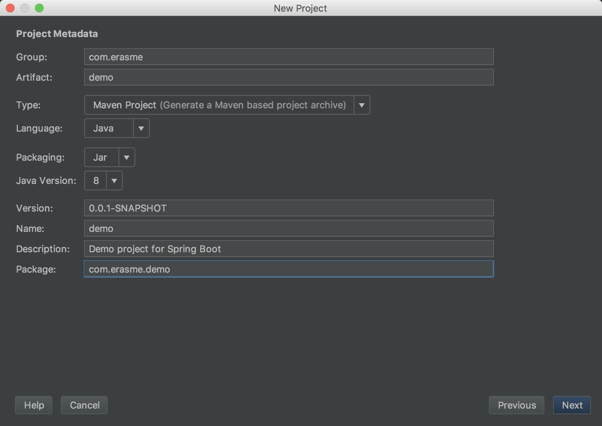
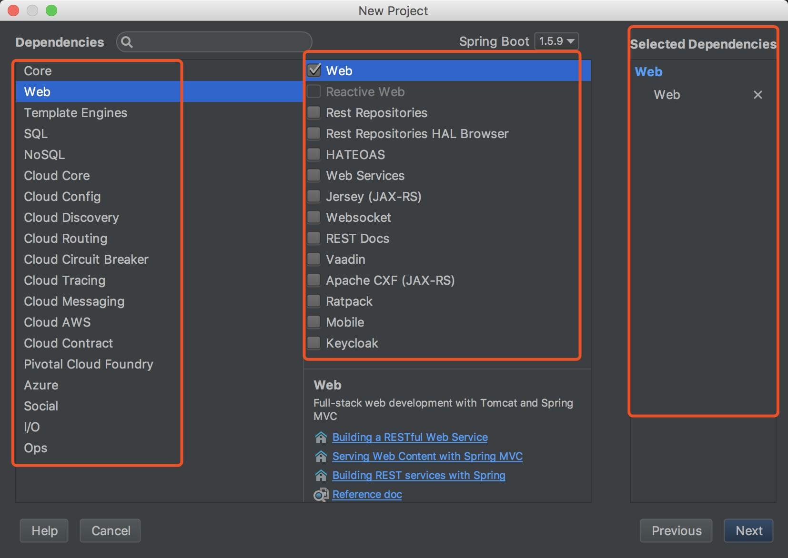
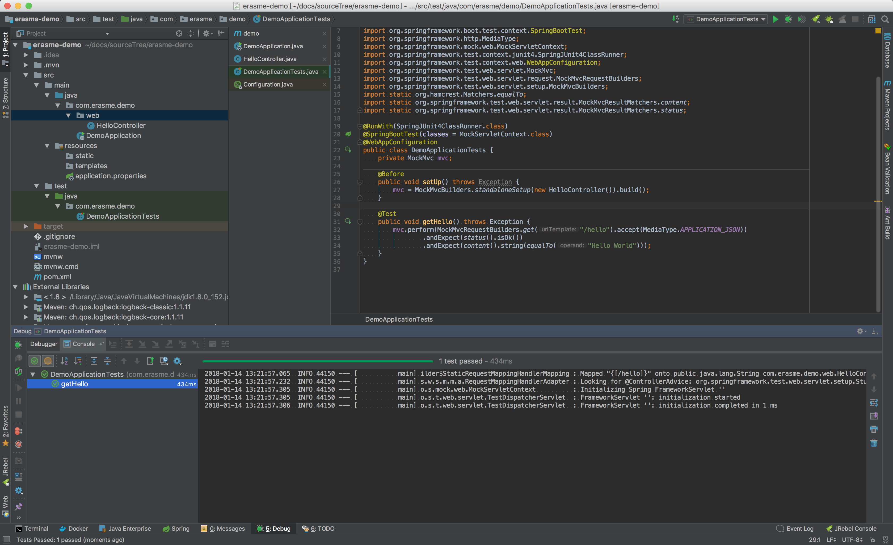

## Spring Boot 核心功能

- 独立运行的Spring项目

`Spring Boot` 可以以`jar`包的形式独立运行，只需使用`java -jar xxx.jar`来运行.

- 内嵌Servlet容器

`Spring Boot` 提供内嵌`Tomcat` `netty` 或者 `Undertow`，我们无需打`war`包在外部容器运行

- 提供Starter 简化配置

`Spring Boot` 提供一系列`starter`的依赖 ___（`maven`，`Gradle`）___
例如，使用`spring-boot-starter-web` 会自动添加以下依赖


会发现其实仅仅是个依赖的打包.

- 自动配置Spring

`Spring Boot` 会根据在类路径中的`jar`包,类,为`jar`包里的类自动配置`Bean`, 极大的减少我们的配置. _(适用于大多数场景)_
实际开发下可能需要我们配置Bean, 则可以自定义配置. _(参见[Spring Boot 配置](../../20161006/Spring-Boot配置))_

- 准生产应用监控

`Spring Boot` 提供了基于Http, ssh, telnet 对应用运行监控 _(参见[Spring Boot 开发部署与测试](.))_

- 无代码生成与XML配置

`Spring Boot` 神奇的是不借助代码实现,而是通过条件注解方式实现.
`Spring` `java config` 是`Spring 4.x`的新特性. 并且`Spring` 提倡使用`Java 配置`与`注解配置`组合,
而`Spring Boot` 无需任何配置即可实现 `Spring` 所有配置.

## Spring Boot 优缺点
### 优点
    1. 为所有Spring开发者更快的入门
    2. 快速构建项目
    3. 开箱即用，提供各种默认配置来简化项目配置
    4. 与主流框架无缝集成
    5. 提供运行时监控
    6. 项目可独立运行，无需外部Servelt容器
    7. 无冗余的配置文件与XML配置文件格式
    8. 与云计算天然集成

### 缺点
    1. 文档少，且多为英文
    2. 不认同Spring框架所认为的缺点

## 快速入门
___以下内容依赖 `JDK 8`, `IntelliJ IDEA`___

### 快速搭建Spring Boot

从`IntelliJ IDEA` __14__ 开始, 直接支持新建`Spring Boot`项目. 当然,也可以在[start.spring.io](http://start.spring.io/)自动生成初始代码.

- 新建`Spring Initializr`项目


- 填写项目信息



- 选用项目技术



- 选用项目名称


- 项目整体目录结构


### 目录介绍

通过上面步骤完成了基础项目的创建，如上图所示，Spring Boot的基础结构共三个文件（具体路径根据用户生成项目时填写的Group所有差异）

- `src/main/java` 下的程序入口：`DemoApplication`
- `src/main/esources` 下的配置文件：`application.properties` _(建议更换为`application.yaml`)_
- `src/test/` 下的测试入口：`DemoApplicationTests`

生成的`DemoApplicationn`和`DemoApplicationTests`类都可以直接运行来启动当前创建的项目.

### 编写HelloWorld服务

- 创建`package`命名为`com.erasme.demo.web`（根据实际情况修改）
- 创建`HelloController`类，内容如下

```java
@RestController
public class HelloController {

    @RequestMapping("/hello")
    public String index() {
        return "Hello World";
    }
}
```
启动主程序，打开浏览器访问[http://localhost:8080/hello](http://localhost:8080/hello)，可以看到页面输出 __Hello World__

### 编写单元测试用例
打开的`src/test/`下的测试入口`DemoApplicationTests`类。下面编写一个简单的单元测试来模拟 http 请求，具体如下：

```java
@RunWith(SpringJUnit4ClassRunner.class)
@SpringBootTest(classes = MockServletContext.class)
@WebAppConfiguration
public class DemoApplicationTests {
    private MockMvc mvc;

    @Before
    public void setUp() throws Exception {
        mvc = MockMvcBuilders.standaloneSetup(new HelloController()).build();
    }

    @Test
    public void getHello() throws Exception {
        mvc.perform(MockMvcRequestBuilders.get("/hello").accept(MediaType.APPLICATION_JSON))
                .andExpect(status().isOk())
                .andExpect(content().string(equalTo("Hello World")));
    }
}
```
使用`MockServletContext`来构建一个空的`WebApplicationContext`，这样我们创建的`HelloController`就可以在`@Before`函数中创建并传递到`MockMvcBuilders.standaloneSetup()`函数中。

注意引入下面内容，让`status`、`content`、`equalTo`函数可用

```java
import static org.hamcrest.Matchers.equalTo;
import static org.springframework.test.web.servlet.result.MockMvcResultMatchers.content;
import static org.springframework.test.web.servlet.result.MockMvcResultMatchers.status;
```



至此已完成目标，通过`Spring Initializr`构建了一个空白`Spring Boot`项目，通过引入`web模块`实现了一个简单的请求处理。
