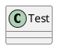

# 什么是Markdown ？
Markdown是一种极简的「标记语言」，目标是实现「易读易写」，他能够将文本转为HTML，而通常不需要关注文本的格式。

# 标题
在Markdown中，你只需要在文本前面加上# 即可，同理、你还可以增加二级标题、三级标题、四级标题、五级标题和六级标题，总共六级，只需要增加# 即可，标题字号相应降低。例如：
```
# 一级标题
## 二级标题
### 三级标题
#### 四级标题
##### 五级标题
###### 六级标题
```
预览可以看到效果：
<!--  -->


# 粗体斜体
```
*斜体文本*    _斜体文本_
**粗体文本**    __粗体文本__
***粗斜体文本***    ___粗斜体文本___
```
预览效果：

*斜体文本*    _斜体文本_
**粗体文本**    __粗体文本__
***粗斜体文本***    ___粗斜体文本___

# 链接
- 常用链接方法

```
文字链接 [链接名称](https://chwshuang.github.io)
网址链接 <https://chwshuang.github.io>
```

预览
文字链接 [链接名称](https://chwshuang.github.io)
网址链接 <https://chwshuang.github.io>

- 高级链接技巧

```
用 1 作为网址变量 [Google][1].
用 yahoo 作为网址变量 [Yahoo!][yahoo].
然后在文档的结尾为变量赋值（网址）
  [1]: http://www.google.com/
  [yahoo]: http://www.yahoo.com/
```

预览
  [1]: http://www.google.com/
  [yahoo]: http://www.yahoo.com/

  [1]

  [yahoo]

# 列表

- 普通无序列表
```
- 列表文本前使用 [减号+空格]
+ 列表文本前使用 [加号+空格]
* 列表文本前使用 [星号+空格]
```
- 普通有序列表
```
1. 列表前使用 [数字+空格]
2. 我们会自动帮你添加数字
7. 不用担心数字不对，显示的时候我们会自动把这行的 7 纠正为 3
```
- 列表嵌套
```
1. 列出所有元素：
    - 无序列表元素 A
        1. 元素 A 的有序子列表
    - 前面加四个空格
2. 列表里的多段换行：
    前面必须加四个空格，
    这样换行，整体的格式不会乱
3. 列表里引用：

    > 前面空一行
    > 仍然需要在 >  前面加四个空格
```

# 引用

- 普通引用

```
> 引用文本前使用 [大于号+空格]
> 折行可以不加，新起一行都要加上哦
```
预览
> 引用文本前使用 [大于号+空格]
> 折行可以不加，新起一行都要加上哦

- 引用里嵌套引用

```
> 最外层引用
> > 多一个 > 嵌套一层引用
> > > 可以嵌套很多层
```
预览
> 最外层引用
> > 多一个 > 嵌套一层引用
> > > 可以嵌套很多层

- 引用里嵌套列表

```
> - 这是引用里嵌套的一个列表
> - 还可以有子列表
>     * 子列表需要从 - 之后延后四个空格开始
```
预览
> - 这是引用里嵌套的一个列表
> - 还可以有子列表
>     * 子列表需要从 - 之后延后四个空格开始

# 图片
跟链接的方法区别在于前面加了个感叹号!
```

```
当然，你也可以像网址那样对图片网址使用变量

这个链接用 1 作为网址变量 [ Google] [ 1].
然后在文档的结尾位变量赋值(网址)
```
[1]: http: //www.google.com/logo.png
```
(也可以使用 HTML 的图片语法来自定义图片的宽高大小)

当然， 如果你的 _ _config.yml_ 开启 _post_asset_folder:_ true 也可以使用这种方法
```

```

# 换行
如果另起一行，只需在当前行结尾加 2 个空格
如果是要起一个新段落，只需要空出一行即可。

# 分隔符

如果你有写分割线的习惯，可以新起一行输入三个减号-。当前后都有段落时，请空出一行：

前面的段落

---

后面的段落

# 注释

用html的注释，好像只有这样？

```
<!-- 注释 -->
```

# 表格

Markdown的扩展语法，hexo已经支持
```
| 参数           | 说明                 |   默认值            |
| ------------- |:-------------------:|:------------------:|
| host          | 远程主机的地址         |                    |
| user          | 使用者名称            |                    |
| root          |  远程主机的根目录      |                    |
| port          | 端口                 |       22           |
| delete        | 删除远程主机上的旧文件   |  true              |
| verbose       | 显示调试信息           |   true             |
| ignore_errors | 忽略错误              |     false          |

```

| 参数           | 说明                 |   默认值            |
| ------------- |:-------------------:|:------------------:|
| host          | 远程主机的地址         |                    |
| user          | 使用者名称            |                    |
| root          |  远程主机的根目录      |                    |
| port          | 端口                 |       22           |
| delete        | 删除远程主机上的旧文件   |  true              |
| verbose       | 显示调试信息           |   true             |
| ignore_errors | 忽略错误              |     false          |

# 高级操作（插件）

- 方式一通过package.json 新增插件库
//保证格式正确：”插件名”: “^版本号”,

```
"hexo-filter-plantuml": "^1.0.1",
"hexo-filter-sequence": "^1.0.3",
"hexo-tag-plantuml": "^1.0.0",
"hexo-pdf": "^1.1.1"
```
执行安装：
```shell
npm (yarn) install
```

- 方式二: 安装单个插件

## hexo-filter-plantuml
安装
```shell
npm install --save hexo-filter-plantuml
```
即下文的作图插件说明中使用的安装方式
hexo使用语法：
\`\`\`puml
@startuml
class Test
@enduml
\`\`\`




## hexo-filter-sequence
安装
```shell
npm install --save hexo-filter-sequence
```
配置
```
_config.yml:
sequence:
  #webfont: https://cdnjs.cloudflare.com/ajax/libs/webfont/1.6.27/webfontloader.js
  #snap: https://cdnjs.cloudflare.com/ajax/libs/snap.svg/0.4.1/snap.svg-min.js
  #underscore: https://cdnjs.cloudflare.com/ajax/libs/underscore.js/1.8.3/underscore-min.js
  #sequence: https://cdnjs.cloudflare.com/ajax/libs/js-sequence-diagrams/1.0.6/sequence-diagram-min.js
  # css: # optional, the url for css, such as hand drawn theme
  options:
    theme: simple
    css_class:
```
*注意缩进*

可以像这样来画uml时序图：
\`\`\`sequence
Lollipop->Su: Hello Su, how are you?
Note right of Su: Su thinks
Su--Lollipop: I am good thanks!
\`\`\`

```sequence
Lollipop->Su: Hello Su, how are you?
Note right of Su: Su thinks
Su-->Lollipop: I am good thanks!
```

## hexo-filter-flowchart
安装
```shell
npm install --save hexo-filter-flowchart
```
配置

```
flowchart:
  # raphael:   # optional, the source url of raphael.js
  # flowchart: # optional, the source url of flowchart.js
  options: # options used for `drawSVG`
```

可以像这样来画uml流程图：
\`\`\`flow
st=>start: Start|past:>http://www.google.com[blank]
e=>end: End:>http://www.google.com
op1=>operation: My Operation|past
op2=>operation: Stuff|current
sub1=>subroutine: My Subroutine|invalid
cond=>condition: Yes
or No?|approved:>http://www.google.com
c2=>condition: Good idea|rejected
io=>inputoutput: catch something...|request

st->op1(right)->cond
cond(yes, right)->c2
cond(no)->sub1(left)->op1
c2(yes)->io->e
c2(no)->op2->e
\`\`\`
```flow
st=>start: Start|past:>http://www.google.com[blank]
e=>end: End:>http://www.google.com
op1=>operation: My Operation|past
op2=>operation: Stuff|current
sub1=>subroutine: My Subroutine|invalid
cond=>condition: Yes
or No?|approved:>http://www.google.com
c2=>condition: Good idea|rejected
io=>inputoutput: catch something...|request

st->op1(right)->cond
cond(yes, right)->c2
cond(no)->sub1(left)->op1
c2(yes)->io->e
c2(no)->op2->e
```

## hexo-pdf
安装：
```shell
npm install --save hexo-pdf
```
hexo使用语法：

普通 PDF
```

```

相对路径
```

```


支持Google盘/Slideshare
```
  
```
  
Slideshare
```

```



## hexo-tag-bilibili
安装
```shell
npm install --save hexo-tag-bilibili
```

配置
```
bilibili:
  width: 452
  height: 544
```

使用
```

or

```
示例



## TeX公式
内联的TeX公式使用一个美元符号标记。
```
$\Gamma(n) = (n-1)!\quad\forall n\in\mathbb N$
```
$\Gamma(n) = (n-1)!\quad\forall n\in\mathbb N$

TeX公式块用独占一行的两个美元符号来标记。
```
$$
\Gamma(z) = \int_0^\infty t^{z-1}e^{-t}dt\,.
$$
```
$$
\Gamma(z) = \int_0^\infty t^{z-1}e^{-t}dt\,.
$$

如果你的编辑器不支持这个功能，可以手动解决。首先引入mathjax脚本：
```html
<script type="text/javascript" src="https://cdn.mathjax.org/mathjax/latest/MathJax.js?config=TeX-AMS_HTML"></script>
```
之后，在需要插入公式的地方使用
```
<script>
```
标签包裹公式：

```html
<script type="math/tex">\Gamma(n) = (n-1)!\quad\forall n\in\mathbb N</script>
<script type="math/tex; mode=display">
\Gamma(z) = \int_0^\infty t^{z-1}e^{-t}dt\,.
</script>

```

TeX的语法参考请见[这里](https://math.meta.stackexchange.com/questions/5020/mathjax-basic-tutorial-and-quick-reference).


# 最后
还是要注意特殊字符的处理,其他的就是排版样式的问题,特殊字符没处理好,就是Hexo渲染报错
